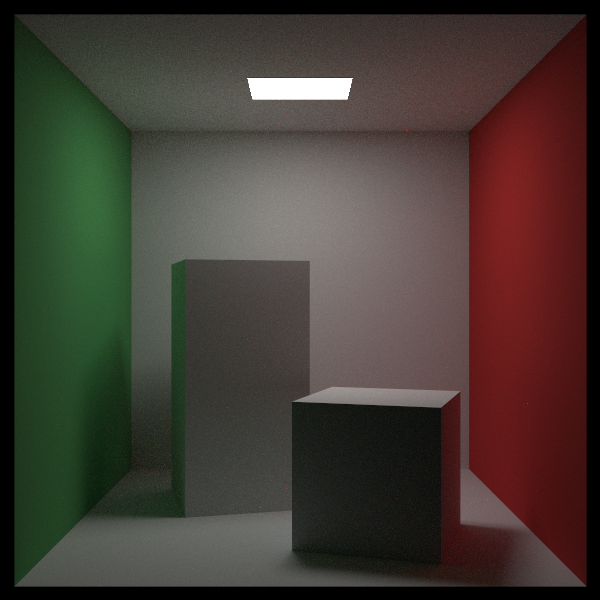
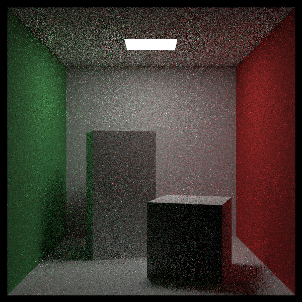

# Mixture Densities (혼합 밀도) — CUDA 적용판

> *Ray Tracing: The Rest of Your Life* 10장을 우리 **CUDA + 레이트레이싱 프로젝트** 기준으로 정리한 문서.
> 원서의 논지를 빠짐없이 따라가되 설명은 우리 말로 다시 썼고, 코드는 전부 우리 GPU 코드다. 실제로 빌드·렌더해서 노이즈와 시간을 측정했다.
> 원서: <https://raytracing.github.io/books/RayTracingTheRestOfYourLife.html> (v4.0.2) · 코드 커밋 `a82fddc`

---

> 💡 **이 장에서 CUDA 때문에 달라지는 큰 그림**
> 1. PDF를 클래스로 묶는다(`Pdf.h`). 원서는 바운스마다 `make_shared`로 PDF를 만들지만, GPU에서 바운스마다 **디바이스 `new`** 를 하면 매우 느리고 힙도 금방 바닥난다. 그래서 전부 **스택에 만드는 작은 값 타입**으로 쓴다(가상 함수는 그대로 동작한다).
> 2. `Hittable`에 `PdfValue`/`Random`을 추가하고 `Quad`가 구현한다. 9장에서 손으로 적던 광원 밀도 식이 사각형 안으로 들어간다.
> 3. `RayColor`는 **광원 PDF와 표면 PDF를 반반 섞어** 방향을 뽑는다. 노이즈(9장)와 밝기(8장)를 **동시에** 잡는다.
> 4. 🐛 혼합 PDF가 드러낸 **에너지 버그**를 하나 잡았다(그림이 6배 밝아졌다). 아래 디버깅 기록.
> 5. 결과: 961 spp에서 뒷벽 노이즈 **17.19 → 12.57**, 시간 **40.9초 → 9.9초**.

---

## 이 장의 목표

지금까지 우리는 두 종류의 PDF를 써 왔다.

- $\cos\theta$ 에 딸린 PDF — **표면**이 빛을 어느 방향으로 보내는지 (7·8장)
- 광원 샘플링에 딸린 PDF — **광원**이 어느 방향에 있는지 (9장)

각각은 장단점이 분명했다. 표면 PDF만 쓰면 밝기는 맞지만 노이즈가 심하고, 광원 PDF만 쓰면 매끈하지만 간접광이 빠져 어둡다. 이 장의 목표는 단 하나다 — **둘을 합친 PDF를 만드는 것**.

---

## 왜 PDF를 클래스로 묶나

PDF는 이미 코드 곳곳에서 쓰이고 있다. 이쯤에서 **쓰는 방식을 표준화**할 때가 됐다.

지금까지 우리에게 PDF란 "방향을 받아 그 방향의 밀도를 돌려주는 함수"였고, 그 값은 늘 셋 중 하나였다 — $1/4\pi$(구 전체 균일), $1/2\pi$(반구 균일), $\cos\theta/\pi$(코사인 가중).

문제는 6장에서 확인한 규칙이다 — **뽑은 분포와 나눈 밀도가 다르면 편향된다.** 실제로 몇몇 실험에서 우리는 PDF의 분포와 **다른** 분포로 방향을 뽑았고, 그때마다 결과가 어긋났다. 일반적으로 **무작위 방향의 분포를 알고 있다면 PDF도 같은 분포를 써야 하고**, 그래야 수렴도 가장 빠르다.

그런데 지금까지 "방향을 뽑는 코드"와 "밀도를 구하는 식"은 여기저기 흩어져 있었다(재질 안, `RayColor` 안, 9장의 하드코딩 블록 안). 둘은 항상 한 쌍이어야 하니 **한 클래스로 묶는다.** PDF 하나가 질 책임은 두 가지다.

1. `Generate` — 자기 분포에 맞춰 무작위 방향을 하나 돌려준다.
2. `Value` — 그 방향에 해당하는 밀도 값을 돌려준다.

표면 PDF와 광원 PDF는 **내부 구현이 전혀 다르지만 인터페이스는 같다** — 클래스 계층이 발명된 이유가 바로 이것이다. 추상 클래스에 무엇을 넣을지는 늘 애매한데, 원서의 방침은 "욕심내지 말고 최소한의 인터페이스로 시작해 보고, 부족하면 그때 늘린다"이다. 우리도 위 두 함수만 두고 시작한다.

> 📄 **파일: `Pdf.h`** *(신규)* — 원서 Listing `class-pdf`, `class-uni-pdf`, `class-cos-pdf`, `class-hittable-pdf`, `class-mixturep-df`에 대응

```cpp
class Pdf
{
public:
    __device__ virtual ~Pdf() {}
    __device__ virtual double Value(const Vector3& direction) const = 0;
    __device__ virtual Vector3 Generate(curandState* randState) const = 0;
};

// 구 전체 균일 (등방성 산란)
class SpherePdf : public Pdf { /* Value: 1/(4 pi),  Generate: RandomUnitVector */ };

// 법선 기준 cos(theta)/pi (Lambertian, 8장의 ONB + 역변환 샘플링)
class CosinePdf : public Pdf
{
public:
    __device__ CosinePdf(const Vector3& w) : mUvw(w) {}

    __device__ double Value(const Vector3& direction) const override
    {
        double cosTheta = Dot(UnitVector(direction), mUvw.W());
        return (cosTheta <= 0.0) ? 0.0 : cosTheta / kPi;
    }

    __device__ Vector3 Generate(curandState* randState) const override
    {
        return mUvw.Transform(RandomCosineDirection(randState));
    }

private:
    Onb mUvw;
};

// 어떤 Hittable(보통 광원)을 향하는 분포. 실제 계산은 그 물체가 한다.
class HittablePdf : public Pdf { /* objects->PdfValue(origin, dir), objects->Random(origin) */ };

// 두 PDF를 반반 섞은 분포
class MixturePdf : public Pdf
{
public:
    __device__ MixturePdf(const Pdf* p0, const Pdf* p1) { mPdf[0] = p0; mPdf[1] = p1; }

    __device__ double Value(const Vector3& direction) const override
    {
        return 0.5 * mPdf[0]->Value(direction) + 0.5 * mPdf[1]->Value(direction);
    }

    __device__ Vector3 Generate(curandState* randState) const override
    {
        return (curand_uniform(randState) < 0.5f)
            ? mPdf[0]->Generate(randState)
            : mPdf[1]->Generate(randState);
    }

private:
    const Pdf* mPdf[2];
};
```

> 🔧 **CUDA 메모 — 힙을 쓰지 않는다**: 원서는 `make_shared<hittable_pdf>(...)`처럼 바운스마다 힙에 PDF를 만든다. GPU에서는 그러면 안 된다(디바이스 `new`는 느리고, 커널 힙은 기본 8MB 정도라 수백만 스레드가 쓰면 금방 터진다). 우리는 `RayColor` 안에서 **지역 변수**로 만들고 `MixturePdf`에는 **포인터만** 넘긴다. 가상 함수 호출은 디바이스에서 정상 동작한다.

### 코사인 PDF로 바꿔 끼우기 (검산)

먼저 `CosinePdf` 하나만 `RayColor`에 꽂아 본다. 8장에서 직접 뽑던 코드와 **정확히 같은 결과**가 나와야 한다 — 계산이 재질에서 PDF 클래스로 올라갔을 뿐 분포는 바뀌지 않았기 때문이다. 실제로 같은 그림이 나왔고, 리팩터링이 안전했음을 확인했다.


---

## `Hittable`에 샘플링 두 함수 추가

이제 광원 같은 `Hittable`을 향해 방향을 뽑아 보자. 그러려면 그 물체가 지금은 답할 수 없는 두 가지 질문에 답해야 한다 — **"내 쪽 방향의 밀도가 얼마인가"** 와 **"내 위의 무작위 한 점은 어디인가"**.

모든 `Hittable` 하위 클래스에 이 둘을 구현해 넣을 수도 있지만, 그건 꽤 번거로운 일이다. 그래서 원서는 **기본 클래스에 시시한 기본 구현 두 개를 둔다**. 이러면 지금까지의 순수 추상 인터페이스가 깨지지만 일이 훨씬 줄어든다. 순수 추상을 유지하고 싶다면 하위 클래스 전부에 써 넣어도 된다.

> 📄 **파일: `Hittable.h`** — 원서 Listing `hittable-plus2`에 대응

```cpp
// origin에서 direction 방향을 봤을 때의 밀도(입체각 기준). 샘플링 대상이 아니면 0.
__device__ virtual double PdfValue(
    const Point3& origin, const Vector3& direction, curandState* randState) const { return 0.0; }

// origin에서 이 물체 위의 무작위 한 점으로 향하는 벡터.
__device__ virtual Vector3 Random(const Point3& origin, curandState* randState) const
{
    return Vector3(1.0, 0.0, 0.0);
}
```

> 🔧 **CUDA 차이**: 우리 `Hit`은 볼륨(2권 9장) 때문에 `curandState*`를 받는다. `PdfValue`가 내부에서 `Hit`을 부르므로 이 인자를 함께 넘겨야 한다. 원서에는 없는 인자다.

`Quad`가 이 둘을 구현한다. 9장에서 `RayColor` 안에 손으로 적었던 식이 그대로 옮겨 왔다.

> 📄 **파일: `Quad.h`** — 원서 Listing `quad-pdf`에 대응

```cpp
__device__ double PdfValue(
    const Point3& origin, const Vector3& direction, curandState* randState) const override
{
    HitRecord rec;
    if (!this->Hit(Ray(origin, direction), 0.001, DBL_MAX, rec, randState))
        return 0.0;

    double distanceSquared = rec.T * rec.T * direction.LengthSquared();
    double cosine = fabs(Dot(direction, rec.Normal) / direction.Length());
    if (cosine < 1e-8)
        return 0.0;

    return distanceSquared / (cosine * mArea);   // 9장의 거리^2 / (cos * 넓이)
}

__device__ Vector3 Random(const Point3& origin, curandState* randState) const override
{
    Point3 p = mQ + (double(curand_uniform(randState)) * mU)
                  + (double(curand_uniform(randState)) * mV);
    return p - origin;
}
```

넓이는 생성자에서 `mArea = |u x v|` 로 캐시해 둔다.

> 📝 **왜 `Quad`만 구현하나**: 우리가 중요도 샘플링하려는 대상이 광원이고, 지금 장면의 광원은 사각형 하나뿐이기 때문이다. 다른 모양의 광원을 쓰거나 광원이 아닌 물체를 샘플링하고 싶다면 그 클래스에도 같은 두 함수를 구현해야 한다(12장에서 `Sphere`와 `HittableList`에 실제로 추가한다).

이것만으로도 효과는 즉시 드러난다. 픽셀당 **10 샘플**이라는 아주 적은 수로도 그림의 형태가 잡힌다 — 8장 방식이라면 같은 샘플 수에서 알아보기 힘든 얼룩이었을 것이다.


---

## 혼합 PDF 클래스

6장에서 잠깐 언급했듯이, **어떤 PDF들이든 선형으로 섞으면 그 결과도 PDF**다. 가중치가 모두 양수이고 합이 정확히 1이기만 하면 된다.

$$ \operatorname{pMixture}() = w_0 p_0() + w_1 p_1() + \ldots + w_{n-1} p_{n-1}() $$

$$ 1 = w_0 + w_1 + \ldots + w_{n-1} $$

우리는 가장 단순한 경우, 즉 **두 밀도의 산술 평균**을 쓴다.

$$ \operatorname{pMixture}(\omega_o) = rac{1}{2}\operatorname{pSurface}(\omega_o) + rac{1}{2}\operatorname{pLight}(\omega_o) $$

여기서 **생각보다 까다로운 지점**이 하나 있다. 방향을 **생성**하는 쪽은 쉽다 — 동전을 던져 둘 중 하나를 골라 그 PDF로 뽑으면 된다. 문제는 **밀도 값을 구하는 쪽**이다.

순진하게 생각하면 "이 방향은 광원 PDF가 만든 거니까 광원 PDF의 밀도를 쓰자"고 할 것 같은데, 그러면 안 된다. 이유는 두 가지다.

1. **어느 PDF가 만들었는지 알아내기가 사실상 불가능하다.** `Generate`가 어떤 난수를 썼는지 `Value`에 알려 줄 배관이 없고, 방향만 보고 역으로 추적하는 것은 악몽에 가깝다.
2. **애초에 그럴 필요가 없다.** 어떤 방향은 **두 PDF 모두가 만들 수 있다**. 예컨대 광원을 향하는 방향은 $\operatorname{pLight}$ 가 만들었을 수도, $\operatorname{pSurface}$ 가 만들었을 수도 있다. 혼합 분포에서 그 방향이 나올 밀도는 "둘 중 하나"가 아니라 **두 밀도를 가중 평균한 값**이다.

그래서 `Value`는 단순히 두 PDF의 밀도를 각각 구해 가중치를 곱해 더한다. 결과적으로 혼합 PDF 클래스는 놀랄 만큼 간단하다(위 `MixturePdf` 참고).

---

## 혼합 PDF를 `RayColor`에

광원 사각형은 `CreateWorld`에서 하나 더 만든다(월드에 넣지 않으므로 BVH나 화면에는 영향이 없다). 재질은 필요 없다 — 밀도 계산과 점 뽑기에만 쓰인다.

```cpp
if (sceneId == 10)
{
    *lights = new Quad(Point3(213.0, 554.0, 227.0),
                       Vector3(130.0, 0.0, 0.0), Vector3(0.0, 0.0, 105.0), nullptr);
}
else
{
    *lights = nullptr;   // 1·2권 장면은 광원 샘플링을 쓰지 않는다
}
```

> 📄 **파일: `kernel.cu`** *(`RayColor`)* — 원서 Listing `ray-color-mixture`에 대응

```cpp
if (bSampleLight && lights != nullptr && *lights != nullptr && pdfValue > 0.0)
{
	CosinePdf surfacePdf(rec.Normal);                  // 스택
	HittablePdf lightPdf(*lights, rec.P, randState);   // 스택
	MixturePdf mixedPdf(&lightPdf, &surfacePdf);       // 포인터만

	Vector3 direction = mixedPdf.Generate(randState);
	scattered = Ray(rec.P, direction, currentRay.Time());
	pdfValue = mixedPdf.Value(direction);

	// 밀도가 0인 방향(광원을 등지는 방향 등)은 기여를 계산할 수 없다.
	if (!(pdfValue > 0.0))
		return accumulated;
}
```

---

## 🐛 실제로 부딪힌 버그: 그림이 6배 밝아졌다

혼합 PDF를 넣고 처음 렌더했을 때 **선형 평균 밝기가 0.0783 → 0.4656**(약 6배)으로 폭발했다. 시간도 40.9초 → 15.8초로 짧아졌는데, 이는 경로가 이상하게 빨리 끝난다는 신호였다.

**원인**: 6장에서 만든 가중 분기가 이랬다.

```cpp
if (scatteringPdf > 0.0 && pdfValue > 0.0) { /* f/p 가중 */ }
else                                       { throughput = throughput * attenuation; }
```

`else`는 원래 **델타 분포 재질**(금속·유리, `pdf = 0`)을 위한 것이었다. 그런데 혼합 PDF는 **광원 쪽 방향**을 뽑기 때문에, Lambertian 표면에서도 **수평선 아래(표면 뒤쪽)를 향하는 방향**이 나올 수 있다. 그런 샘플은 `scatteringPdf == 0`이고 기여도 0이어야 하는데, 위 코드에서는 `else`로 흘러가 **감쇠만 곱한 채 레이가 계속 나아갔다**. 바운스마다 없는 에너지가 더해진 것이다.

**고침**: 재질이 밀도를 알려준 경우(`pdfValue > 0`, 즉 확률적 산란 재질)에는 `scatteringPdf == 0`이면 **경로를 끝낸다**.

```cpp
if (pdfValue > 0.0)
{
	if (!(scatteringPdf > 0.0))
		return accumulated;      // 이 방향으로는 산란하지 않는다 → 기여 0

	throughput = throughput * attenuation * (scatteringPdf / pdfValue);
}
else
{
	throughput = throughput * attenuation;   // 델타 분포(금속·유리)
}
```

고친 뒤 밝기가 기준값으로 돌아왔다(0.0764). 이 버그는 9장까지는 드러나지 않았다 — 그때는 방향을 뽑는 주체가 재질 자신이라 수평선 아래 방향이 나올 수 없었기 때문이다. **샘플링 분포를 바꾸면 "있을 수 없다고 가정했던 경우"가 생긴다**는 교훈.

---

## 결과




| 961 spp | 선형 평균 밝기 | 뒷벽 표준편차 | 시간 |
|---|---|---|---|
| 8장 (표면 PDF만) | 0.0783 | 17.19 | 40.9초 |
| 10장 (혼합 PDF) | 0.0764 | **12.57** | **9.9초** |

- 노이즈가 **27% 줄고** 시간은 **4배 빨라졌다**(광원을 맞힌 경로가 즉시 끝나기 때문).
- 밝기 차이 2%는 편향이 아니라 **측정 지표의 성질**이다. 우리 "선형 평균"은 감마 인코딩된 픽셀을 제곱해 재므로, 노이즈가 크면 평균이 부풀려진다. 실제로 $(17.19^2 - 12.57^2)/255^2 \approx 0.0021$ 로, 관측된 차이 0.0019와 거의 같다.

같은 9 spp에서 세 방식을 비교하면 이 장의 의미가 분명해진다.



| 9 spp | 선형 평균 밝기 | 뒷벽 표준편차 | 평가 |
|---|---|---|---|
| 광원 샘플링 없음 (8장 방식) | 0.0683 | 90.5 | 밝기는 맞지만 노이즈가 심하다 |
| 광원만 샘플링 (9장 하드코딩) | 0.0432 | 15.4 | 매끈하지만 **어둡다**(간접광 누락) |
| 혼합 PDF (10장) | **0.0763** | 26.5 | 밝기도 맞고 노이즈도 크게 줄었다 |

혼합 PDF 쪽이 벽 색이 물체에 번지는 **색 번짐(color bleeding)** 을 그대로 살리면서 노이즈만 줄인 것을 확인할 수 있다.

---

## 결과 & 검증

- **빌드/실행 확인**: VS2022 + CUDA 12.9 Release로 컴파일·링크·실행 성공.
- **노이즈/속도**: 961 spp에서 17.19 → 12.57, 40.9초 → 9.9초.
- **정확성**: 9 spp에서도 961 spp와 같은 밝기(0.0763 vs 0.0764).
- **1·2권 장면**: `lights == nullptr`이라 혼합 경로를 타지 않는다(기존과 동일).

### 변경 파일 요약

| 원서 Listing | 우리 파일 | 메모 |
|---|---|---|
| `class-pdf` 외 4종 | `Pdf.h` *(신규)* | `SpherePdf`, `CosinePdf`, `HittablePdf`, `MixturePdf` — 전부 스택 값 타입 |
| `hittable-plus2` | `Hittable.h` | `PdfValue`/`Random` 기본 구현(+ `curandState*` 인자) |
| `quad-pdf` | `Quad.h` | 사각형의 밀도/점 뽑기, `mArea` 캐시 |
| `ray-color-mixture` | `kernel.cu` (`RayColor`) | 혼합 PDF로 방향 생성, 9장 하드코딩 제거 |
| `scene-density-mixture` | `kernel.cu` (`CreateWorld`, `main`, `FreeWorld`) | 광원 사각형 생성·전달·해제 |
| — | `kernel.cu` (`RayColor`) | 🐛 수평선 아래 방향의 기여를 0으로 (에너지 버그 수정) |

### CUDA 적용에서 꼭 기억할 3가지

1. **PDF 객체는 스택에**: 바운스마다 디바이스 `new`를 하면 느리고 힙도 터진다. 값 타입 + 포인터 전달로 같은 설계를 GPU에서 그대로 쓸 수 있다.
2. **샘플링 분포를 바꾸면 가정도 바뀐다**: "수평선 아래 방향은 안 나온다"는 가정이 깨지면서 에너지 버그가 생겼다. 분포를 바꿀 때는 기여가 0이어야 하는 경우를 다시 점검하자.
3. **밝기 지표의 함정**: 감마 인코딩된 이미지의 제곱 평균은 노이즈가 클수록 커진다. 노이즈가 다른 두 렌더의 밝기를 비교할 때는 이 편향을 감안해야 한다.
