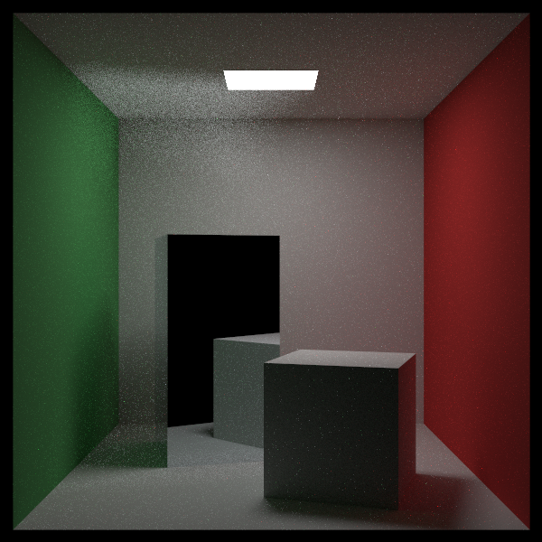
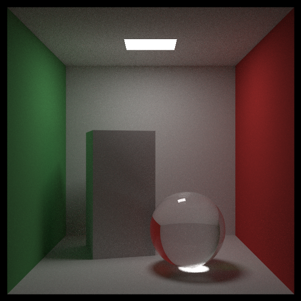

# Cleaning Up PDF Management (PDF 관리 정리) — CUDA 적용판

> *Ray Tracing: The Rest of Your Life* 12장을 우리 **CUDA + 레이트레이싱 프로젝트** 기준으로 정리한 문서.
> 원서의 흐름(확산 대 정반사 → ScatterRecord → 구 샘플링 → 광원 리스트 → NaN)을 따라가되 설명은 요약·재구성했고, 코드는 전부 우리 GPU 코드다. 실제로 빌드·렌더해서 확인했다.
> 원서: <https://raytracing.github.io/books/RayTracingTheRestOfYourLife.html> (v4.0.2) · 코드 커밋 `28a2ef6`

---

> 💡 **이 장에서 CUDA 때문에 달라지는 큰 그림**
> 1. 재질이 돌려주는 값이 많아져서(감쇠, PDF, 정반사 여부, 정반사 레이) **`ScatterRecord`** 하나로 묶는다. 원서는 `shared_ptr<pdf>`를 담지만, 우리는 **PDF를 값으로 품고 포인터로 가리킨다** — 바운스마다 디바이스 `new`를 하지 않기 위해서다.
> 2. `Pdf.h`와 `Material.h`가 서로를 필요로 하게 되어 **`Sampling.h`** 로 공통 도우미(π, 방향 생성기)를 뺐다.
> 3. 정반사는 `bSkipPdf` 플래그로 **명시화**했다. 우리는 6장부터 "pdf == 0이면 감쇠만"이라는 규칙으로 이미 지켜 왔으므로, 원서처럼 중간에 거울·유리가 깨진 적이 없다.
> 4. `Sphere`와 `HittableList`도 샘플링 대상이 된다 → **광원이 여러 개**(천장 광원 + 유리 구)인 장면을 만들 수 있다.
> 5. PPM 출력에 **NaN 가드**를 넣었다.

---

## 확산이냐 정반사냐: `ScatterRecord`

니스 칠한 나무처럼 **일부는 정반사, 일부는 확산**인 재질을 다루려면, 재질이 "이번 산란은 어느 쪽인지"를 알려줄 수 있어야 한다. 원서는 재질이 레이 두 개를 만드는 대신 **무작위로 하나를 고르는** 쪽을 택한다. 그러면 `RayColor`는 이번 산란이 정반사인지 알아야 하고, 정반사일 때는 PDF를 묻지 말아야 한다.

인자를 계속 늘리는 대신 구조체로 묶는다.

> 📄 **파일: `Material.h`** — 원서 Listing `material-refactor`에 대응

```cpp
struct ScatterRecord
{
    Color Attenuation;
    const Pdf* PdfPtr;     // bSkipPdf == false일 때 유효 (아래 저장소 중 하나를 가리킨다)
    bool bSkipPdf;
    Ray SkipPdfRay;        // bSkipPdf == true일 때 따라갈 레이

    // PDF 저장소(디바이스 new 회피용)
    CosinePdf CosinePdfStorage;
    SpherePdf SpherePdfStorage;

    __device__ ScatterRecord() : PdfPtr(nullptr), bSkipPdf(false) {}
};
```

> 🔧 **CUDA 메모 — `shared_ptr<pdf>` 대신 값 저장소**: 원서는 `srec.pdf_ptr = make_shared<cosine_pdf>(rec.normal)` 로 힙에 PDF를 만든다. GPU에서는 바운스마다 힙 할당을 할 수 없으므로, **쓸 수 있는 PDF들을 `ScatterRecord` 안에 값으로 품고 있다가** `PdfPtr`로 그중 하나를 가리킨다. `ScatterRecord` 자체가 `RayColor`의 스택에 있으니 추가 할당이 전혀 없다.
> ⚠️ 대신 **이 레코드를 복사하면 안 된다**(복사본의 `PdfPtr`이 원본 내부를 가리킨다). 항상 참조로만 넘긴다.

재질 쪽은 오히려 단순해진다. Lambertian은 이제 방향을 뽑지 않고 "코사인 분포로 뽑아 달라"고 PDF만 넘긴다.

```cpp
// Lambertian
srec.Attenuation = mTexture->Value(rec.U, rec.V, rec.P);
srec.CosinePdfStorage = CosinePdf(rec.Normal);
srec.PdfPtr = &srec.CosinePdfStorage;
srec.bSkipPdf = false;
return true;

// Metal (Dielectric도 같은 모양)
srec.Attenuation = mAlbedo;
srec.PdfPtr = nullptr;
srec.bSkipPdf = true;
srec.SkipPdfRay = reflectedRay;
```

`RayColor`는 정반사를 한 줄로 처리한다.

```cpp
ScatterRecord srec;
if (!rec.MaterialPtr->Scatter(currentRay, rec, srec, randState))
	return accumulated;

// 정반사(거울/유리): 밀도로 나눌 수 없는 델타 분포 → 그대로 따라간다.
if (srec.bSkipPdf)
{
	throughput = throughput * srec.Attenuation;
	currentRay = srec.SkipPdfRay;
	continue;
}
```

> 📝 **우리는 이미 지키고 있었다**: 원서는 6장부터 11장까지 금속·유리가 깨진 상태로 진행하다가 여기서 고친다. 우리는 6장에서 "`ScatteringPdf`가 0이면 감쇠만 곱한다"는 규칙을 먼저 넣어 두었기 때문에 1·2권 장면이 3권 내내 정상으로 렌더됐다. 12장은 그 규칙을 **플래그로 명시화**한 셈이다.

---

## 순환 include와 `Sampling.h`

`ScatterRecord`가 `CosinePdf`를 값으로 품으려면 `Material.h`가 `Pdf.h`를 include해야 한다. 그런데 `Pdf.h`는 `RandomCosineDirection`·`kPi` 때문에 `Material.h`를 include하고 있었다 — **순환**이다.

공통으로 쓰는 것들(π, `RandomInUnitSphere`, `RandomUnitVector`, `RandomCosineDirection`, 이번에 추가한 `RandomToSphere`)을 `Sampling.h`로 빼서 끊었다.

```text
Material.h  ->  Pdf.h  ->  Sampling.h        (순환 없음)
```

헤더만 옮긴 기계적인 작업이지만 GPU 코드에서는 특히 중요하다 — 디바이스 함수는 전부 헤더에 인라인으로 들어가므로 include 그래프가 곧 컴파일 단위의 크기다.

---

## 구를 향한 샘플링

유리 구를 "중요한 물체"로 삼아 그쪽으로 레이를 더 보내려면, 구를 향한 방향을 균일하게 뽑고 그 밀도를 알아야 한다.

밖의 한 점에서 구를 보면 구는 **원뿔** 모양의 입체각을 차지한다. 구 표면에서 아무 점이나 고르면 뒤쪽(가려진) 면을 고를 수 있으니, 보이는 쪽을 덮는 이 원뿔 안에서 균일하게 뽑는다.

$$ \sin\theta_{max} = \frac{R}{\lVert c - p \rVert} \;\Rightarrow\; \cos\theta_{max} = \sqrt{1 - \frac{R^2}{\lVert c - p \rVert^2}} $$

$$ \text{입체각} = 2\pi\,(1 - \cos\theta_{max}), \qquad p(\omega) = \frac{1}{\text{입체각}} $$

θ는 7장과 같은 방식으로 역변환해서 뽑는다: $\cos\theta = 1 + r_2\,(\cos\theta_{max} - 1)$.


> 📄 **파일: `Sampling.h`, `Sphere.h`** — 원서 Listing `sphere-pdf`에 대응

```cpp
// Sampling.h — z축이 구 중심 방향인 좌표계에서 원뿔 안의 방향 하나
__device__ inline Vector3 RandomToSphere(double radius, double distanceSquared, curandState* randState)
{
    double r1 = curand_uniform_double(randState);
    double r2 = curand_uniform_double(randState);

    double cosThetaMax = sqrt(1.0 - radius * radius / distanceSquared);
    double z = 1.0 + r2 * (cosThetaMax - 1.0);

    double phi = 2.0 * kPi * r1;
    double sinTheta = sqrt(fmax(0.0, 1.0 - z * z));

    return Vector3(cos(phi) * sinTheta, sin(phi) * sinTheta, z);
}

// Sphere.h
__device__ double PdfValue(const Point3& origin, const Vector3& direction, curandState* randState) const override
{
    HitRecord rec;
    if (!this->Hit(Ray(origin, direction), 0.001, DBL_MAX, rec, randState))
        return 0.0;

    double distanceSquared = (mCenter - origin).LengthSquared();
    if (distanceSquared <= mRadius * mRadius)
        return 0.0;   // 구 안에서는 이 공식이 성립하지 않는다

    double cosThetaMax = sqrt(1.0 - mRadius * mRadius / distanceSquared);
    double solidAngle = 2.0 * kPi * (1.0 - cosThetaMax);
    return 1.0 / solidAngle;
}

__device__ Vector3 Random(const Point3& origin, curandState* randState) const override
{
    Vector3 direction = mCenter - origin;
    Onb uvw(direction);                                   // 8장의 ONB로 방향을 돌린다
    return uvw.Transform(RandomToSphere(mRadius, direction.LengthSquared(), randState));
}
```

---

## 광원이 여럿일 때: `HittableList`도 샘플링 대상

천장 광원과 유리 구를 **둘 다** 샘플링하려면 목록 자체가 PDF를 가져야 한다. 각각을 1/n 확률로 고르므로 밀도는 평균이다.

> 📄 **파일: `HittableList.h`** — 원서 Listing `density-mixture`에 대응

```cpp
__device__ double PdfValue(const Point3& origin, const Vector3& direction, curandState* randState) const override
{
    double weight = 1.0 / double(mCount);
    double sum = 0.0;
    for (int i = 0; i < mCount; i++)
        sum += weight * mList[i]->PdfValue(origin, direction, randState);
    return sum;
}

__device__ Vector3 Random(const Point3& origin, curandState* randState) const override
{
    // curand_uniform은 (0,1]이라 그대로 곱하면 mCount가 나올 수 있다 → 마지막 칸으로 클램프
    int index = int(curand_uniform(randState) * float(mCount));
    if (index >= mCount)
        index = mCount - 1;
    return mList[index]->Random(origin, randState);
}
```

장면 12의 광원 목록은 `CreateWorld`에서 만든다. `HittableList`가 소유(`bOwns = true`)하므로 `FreeWorld`가 `*lights` 하나만 지우면 내부 사각형·구와 배열까지 연쇄 해제된다.

```cpp
Hittable** lightList = new Hittable*[2];
lightList[0] = new Quad(Point3(213, 554, 227), Vector3(130, 0, 0), Vector3(0, 0, 105), nullptr);
lightList[1] = new Sphere(Point3(190, 90, 190), 90.0, nullptr);
*lights = new HittableList(lightList, 2, true);
```

---

## NaN 가드

몬테카를로 렌더러의 본체는 "아주 많은 샘플의 평균"이다. 그래서 **샘플 하나가 NaN이면 그 픽셀 전체가 죽는다**(검은 점, 원서 표현으로 acne). 원서는 수천만~1억 레이에 한 번쯤 나온다고 적는다. NaN은 **자기 자신과 같지 않다**는 성질로 걸러 낸다.

```cpp
// kernel.cu — PPM 출력 직전
if (col.X() != col.X()) col[0] = 0.0;
if (col.Y() != col.Y()) col[1] = 0.0;
if (col.Z() != col.Z()) col[2] = 0.0;
```

---

## 결과

### 알루미늄 상자 (장면 11)

키 큰 상자를 금속(`Metal(Color(0.8, 0.85, 0.88), 0.0)`)으로 바꾼다. 정반사가 되살아났는지 확인하는 장면이다.




거울 상자가 **꽤 어둡게** 보이는데 이는 정상이다 — 코넬 박스는 카메라 쪽 벽이 없으므로 거울이 그 **뚫린 앞면(배경 = 검정)** 을 비추기 때문이다. 실제로 상자 영역 픽셀의 **47%가 0이 아니고**(최댓값 148) 벽·바닥이 비친 부분이 보인다. 원서가 지적한 대로 **천장의 반사가 눈에 띄게 노이즈**하다(천장 표준편차 45.1 vs 장면 10의 41.4) — 상자 쪽 방향을 더 촘촘히 샘플링하지 않기 때문이다.

### 유리 구 (장면 12)

키 작은 상자를 유리 구로 바꾸고, 광원 목록에 **천장 광원과 유리 구를 함께** 넣는다.




구 아래의 **집광(caustic)** 이 또렷하게 잡힌다.

| 961 spp | 선형 평균 밝기 | 뒷벽 표준편차 | 시간 |
|---|---|---|---|
| 장면 10 (흰 상자 2개) | 0.0764 | 12.57 | 9.9초 |
| 장면 11 (알루미늄 상자) | 0.0764 | 13.33 | 8.6초 |
| 장면 12 (유리 구) | 0.0854 | 13.03 | 23.8초 |

유리 구 장면이 2배 이상 느린 것은 원서에서도 언급하는 현상이다 — 유리에 부딪힌 레이는 반사·굴절로 계속 살아남아 경로가 길어진다.

### 1·2권 장면 회귀 확인

모든 재질의 `Scatter` 시그니처를 바꿨으므로 예전 장면들을 다시 렌더해 확인했다.

| 장면 | 설정 | 결과 |
|---|---|---|
| 0 (1권 최종: 구 488개, 금속·유리 포함) | 100 spp, 5.3초 | 정상 — 금속 반사·유리 굴절 모두 그대로 |
| 8 (코넬 연기: `Isotropic` 볼륨) | 64 spp, 3.5초 | 정상 — 어두운 연기와 밝은 안개 모두 보임 |

---

## 결과 & 검증

- **빌드/실행 확인**: VS2022 + CUDA 12.9 Release로 컴파일·링크·실행 성공.
- **정반사 복구**: 알루미늄 상자가 방을 비춘다(상자 영역 47%가 0이 아님).
- **구 샘플링**: 유리 구 아래 집광이 또렷하고, 광원 목록(사각형 + 구)이 동작한다.
- **회귀**: 1·2권 장면(금속/유리/볼륨) 모두 정상.

### 변경 파일 요약

| 원서 Listing | 우리 파일 | 메모 |
|---|---|---|
| `material-refactor` | `Material.h` | `ScatterRecord`(PDF 값 저장소와 `PdfPtr`), `Scatter` 시그니처 정리 |
| `lambertian-scatter`, `isotropic-scatter` | `Material.h` | 방향을 뽑지 않고 PDF만 돌려준다 |
| `material-scatter` | `Metal.h`, `Dielectric.h` | `bSkipPdf`, `SkipPdfRay` |
| `ray-color-implicit` | `kernel.cu` (`RayColor`) | 정반사는 감쇠만 곱하고 그대로 진행 |
| `sphere-pdf` | `Sphere.h`, `Sampling.h` | 원뿔 샘플링 `RandomToSphere`, 구의 밀도 |
| `density-mixture` | `HittableList.h` | 목록 평균 밀도 / 무작위 선택 |
| `scene-cornell-al`, `sampling-sphere` | `kernel.cu` | 장면 11·12, 광원 목록 |
| `write-color-nan` | `kernel.cu` | NaN 가드 |
| — | `Sampling.h` *(신규)* | 순환 include 해소 |

### CUDA 적용에서 꼭 기억할 3가지

1. **다형성은 쓰되 힙은 쓰지 않는다**: PDF를 `ScatterRecord` 안에 값으로 품고 포인터로 가리키면, 원서의 `shared_ptr` 설계를 GPU에서 그대로 재현하면서 할당을 0으로 만들 수 있다. 대신 그 레코드를 복사하면 안 된다.
2. **헤더 순환은 공통 도우미를 빼서 끊는다**: 디바이스 함수는 전부 헤더에 있으므로 include 그래프가 곧 컴파일 단위다.
3. **NaN은 한 픽셀을 통째로 죽인다**: 출력 직전에 `x != x` 로 걸러 주는 세 줄이 값싼 보험이다.
