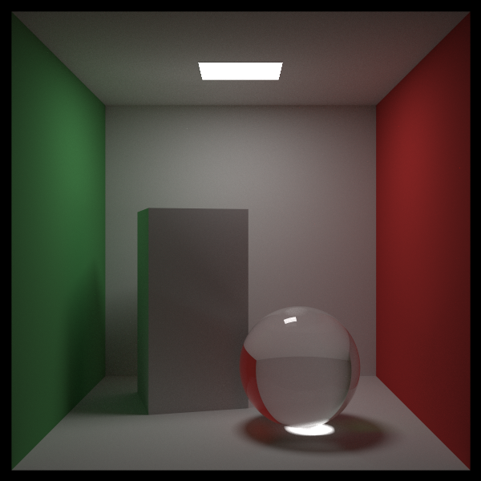

# The Rest of Your Life (남은 인생 동안) — CUDA 적용판

> *Ray Tracing: The Rest of Your Life* 13장(마무리)을 우리 **CUDA + 레이트레이싱 프로젝트** 기준으로 정리한 문서.
> 원서 13장은 "이제 어디로 갈 것인가"를 짧게 짚는 장이다. 여기에 **3권 전체를 CUDA로 옮기며 확인한 것들**을 회고로 덧붙였다.
> 원서: <https://raytracing.github.io/books/RayTracingTheRestOfYourLife.html> (v4.0.2) · 코드 커밋 `d0eea2b`

---

## 원서가 권하는 다음 단계

원서는 이 책의 목적이 "물리 기반 렌더러의 **샘플링 방식**을 빠짐없이 정리하는 것"이었다고 말하며, 관심사에 따라 갈 만한 길을 짚어 준다.

- **몬테카를로 자체를 더 파고들기** — 양방향 경로 추적, 경로 공간(path space) 접근(Metropolis 등). 확률 공간이 "입체각"이 아니라 "경로"가 된다.
- **영화용 렌더러** — 스튜디오와 Solid Angle 쪽 논문들이 의외로 많이 공개돼 있다.
- **고성능 레이트레이싱** — Intel과 NVIDIA의 논문들.
- **엄밀한 물리 기반** — RGB를 스펙트럼으로 바꾸기. 레이마다 무작위 파장 하나를 들고 다니는 방식이 추천된다.
- **어느 길로 가든** — 광택(glossy) BRDF 모델 하나쯤은 추가해 보라는 조언.

---

## 3권을 통과하며 달라진 것

같은 코넬 박스를 같은 샘플 수(961 spp, 600x600, RTX 5070 Ti)로 렌더한 결과다.

| 장 | 무엇을 했나 | 뒷벽 노이즈 | 시간 |
|---|---|---|---|
| 6장 | 표면 PDF만(코사인), 진짜 Lambertian으로 교정 | 17.26 | 32.3초 |
| 8장 | ONB + 역변환 샘플링으로 리팩터링(결과 동일) | 17.19 | 40.9초 |
| 10장 | 광원 PDF와 표면 PDF를 반반 섞음 | **12.57** | **9.9초** |

9 spp로 내려 보면 차이가 더 분명하다.

| 9 spp | 밝기(선형 평균) | 뒷벽 노이즈 |
|---|---|---|
| 광원 샘플링 없음 | 0.0683 | 90.5 |
| 광원만 샘플링(9장 하드코딩) | 0.0432 *(어두움 — 간접광 누락)* | 15.4 |
| 혼합 PDF(10장) | **0.0763** | 26.5 |

즉 3권의 성과는 "**같은 시간에 더 조용한 그림**"이 아니라 **"훨씬 적은 샘플로 같은 그림"** 이다. 노이즈가 27% 줄고 시간이 4배 빨라진 것은, 광원을 맞힌 경로가 즉시 끝나 GPU에서 워프 전체의 바운스 루프가 짧아진 덕이 크다.

---

## 우리가 직접 확인한 것들

문서를 쓰면서 수치로 확인한 것들 중 기록해 둘 만한 것.

1. **우리 Lambertian은 Lambertian이 아니었다** (5장). "법선 + 단위 공 *안*의 점"은 cos θ/π가 아니라 **cos³θ** 분포였다(평균 cos 0.8 vs 2/3). GPU 히스토그램으로 확인하고 6장에서 "구 *위*의 점"으로 교정했다. 코넬 박스가 눈에 띄게 달라진다(선형 평균 0.0975 → 0.0784).
2. **원서의 2차 PDF 역함수 표기 오류** (3장). $P(x) = x^3/8$의 역함수는 $(8d)^{1/3} = 2d^{1/3}$인데 원서는 $8d^{1/3}$로 적었다. 그런데도 답이 맞는 이유는 그 PDF에서 $f/p = 8/3$이 상수이기 때문이다.
3. **원서 "균일 PDF" 실험 코드는 편향된다** (6장). 방향은 코사인 분포로 뽑으면서 분모만 $1/2\pi$로 바꾸면 바운스마다 4/3배가 된다. 화로 테스트로 0.9733 = 4A/3를 확인했고, 우리는 방향도 균일하게 뽑아 바르게 실험했다.
4. **혼합 PDF가 드러낸 에너지 버그** (10장). 광원 쪽 방향은 표면 아래를 향할 수 있는데, 그 경우를 "정반사"처럼 처리하면 그림이 **6배** 밝아진다. 샘플링 분포를 바꾸면 "있을 수 없다"고 가정했던 경우가 생긴다.
5. **마이크로벤치마크 함정** (7장). 생성한 방향의 z성분만 쓰면 컴파일러가 나머지 계산을 지워 **27배**라는 엉터리 수치가 나온다. 세 성분을 모두 쓰면 2.19배.
6. **데모의 속도 이득이 렌더러의 이득은 아니다** (8장). 생성만 재면 역변환법이 2배 빠르지만, 렌더러에서는 ONB 구성 등 바운스당 연산이 늘어 오히려 느려졌다(32.3초 → 40.9초). 실제 장면으로 재야 한다.

---

## CUDA 적용 총정리

3권을 옮기며 반복해서 만난 원칙들.

| 주제 | 정리 |
|---|---|
| **힙을 쓰지 않는다** | PDF 객체는 전부 스택 값 타입. `ScatterRecord`가 `CosinePdf`/`SpherePdf`를 값으로 품고 `PdfPtr`로 가리킨다. 바운스마다 디바이스 `new`를 하면 느리고 커널 힙이 금방 바닥난다 |
| **워프 발산** | 거절법 루프의 비용은 "평균 시도 횟수"가 아니라 **워프 안 최대값**이다(레인 활용률 32%). 루프 없는 역변환법이 GPU에 잘 맞는다 |
| **워프 단위 연산** | `__syncthreads_count`, `__shfl_xor_sync` 앞에서는 조기 `return` 금지. 범위 밖 스레드도 플래그로 따라오게 한다 |
| **집계 패턴** | 스레드별 지역 합 → 블록 집계 → 전역 원자 연산 1회. 히스토그램은 공유 메모리 사유화 |
| **`atomicAdd(double*)`** | sm_60 이상 전용. compute_52 빌드에서는 부분합 배열 + `thrust::reduce` |
| **무거운 헤더 격리** | thrust 호출은 `DemoThrust.cu`에만. 디바이스 함수는 전부 헤더에 인라인되므로 include 그래프가 곧 컴파일 단위 |
| **난수** | 렌더러는 `curandState`(XORWOW), 수백만 스레드를 띄우는 데모는 초기화가 빠른 **Philox**. `curand_uniform`은 `(0,1]` |
| **줄끝(CRLF)** | LF 파일 + 한글 주석 = nvcc EDG가 줄바꿈을 삼켜 엉뚱한 곳에서 파싱 오류. 새 소스는 반드시 CRLF |
| **정밀도** | 전 구간 `double`. 소비자용 GPU에서 FP64는 1/64 속도라 가장 큰 최적화 후보 |
| **경로 종료** | 광원을 맞히면 경로가 끝난다 → 워프 전체가 함께 짧아져 GPU에서 이득이 배가된다 |

---

## 우리 프로젝트의 다음 과제

원서의 "다음 단계"와는 별개로, 이 코드베이스에 남은 일들.

1. **float 전환** — 가장 큰 단일 최적화. `Vector3`부터 내려가야 의미가 있다(8장에서 삼각함수만 float로 바꿔 본 결과는 6% 개선에 그쳤다).
2. **해시 기반 RNG** — README 로드맵의 PCG/XORShift는 아직 미적용.
3. **배경 인프라** — 지금은 단색. 환경 맵(HDR)을 넣으려면 구조가 필요하다. 출력은 이미 HDR이고 잘라 내는 지점은 PPM 저장 한 곳뿐이라, EXR로 바꾸면 그대로 살릴 수 있다.
4. **그림자 레이와 비교** — 11장에서 정리한 대안. GPU에서는 "짧고 균일한" 레이라는 장점이 있어 실제로 재 볼 만하다.
5. **광원 샘플링 대상 확대** — 지금은 `Quad`와 `Sphere`만 `PdfValue`/`Random`을 구현한다. 상자(인스턴스)까지 넣으면 12장의 알루미늄 상자 천장 반사 노이즈를 줄일 수 있다.

---

## 최종 이미지

3권의 마지막 장면(유리 구가 있는 코넬 박스)을 **10,000 spp**(100x100 층화)로 렌더했다.

RTX 5070 Ti에서 **266초**(4분 26초). 961 spp(23.8초)와 비교하면 샘플은 10.4배, 시간도 11배다 — 이 장면은 유리 때문에 경로가 길어 샘플 수에 거의 선형으로 비례한다.

> 📝 **측정 지표의 한계**: 이 문서들에서 노이즈 지표로 쓴 "뒷벽 표준편차"는 961 spp에서 13.03, 10,000 spp에서 12.46으로 거의 줄지 않았다. 그 영역에는 **실제 밝기 변화(그라데이션)** 가 섞여 있어 표준편차에 바닥값이 있기 때문이다. 장 사이 비교(90.5 → 26.5 → 13.0)처럼 차이가 클 때는 쓸 만하지만, 이미 수렴한 이미지들 사이를 가르기에는 무딘 자다.

---

## 마무리

1권에서 "픽셀마다 레이 하나"로 시작한 코드가, 3권을 지나며 **"어디를 얼마나 샘플링할지 스스로 정하는"** 렌더러가 되었다. 수식으로는 $\int f \approx \sum f(r)/p(r)$ 한 줄이지만, 그 한 줄을 GPU에서 제대로 굴리기 위해 힙·워프·정밀도·헤더 구조까지 건드려야 했다.

그리고 3권이 가장 강조하는 교훈은 결국 이것이다 — **몬테카를로에서 가장 찾기 어려운 버그는 "그럴듯한 그림이 나오는 버그"다.** 이 문서들에 기록한 다섯 건(cos³ Lambertian, 원서 역함수 표기, 편향된 균일 PDF, 6배 에너지 버그, 27배 벤치마크)이 전부 그런 종류였고, 전부 **숫자로 재 보고서야** 드러났다.

> 원서: Peter Shirley, Trevor David Black, Steve Hollasch, *Ray Tracing: The Rest of Your Life* (v4.0.2)
> <https://raytracing.github.io/books/RayTracingTheRestOfYourLife.html>
