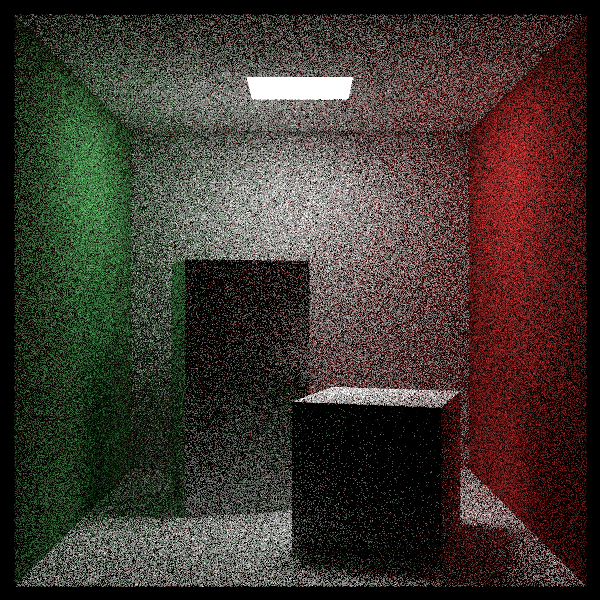
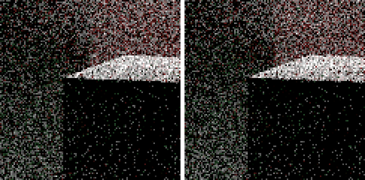

# A Simple Monte Carlo Program (간단한 몬테카를로 프로그램) — CUDA 적용판

> *Ray Tracing: The Rest of Your Life* 2장을 우리 **CUDA + 레이트레이싱 프로젝트** 기준으로 정리한 문서.
> 원서의 흐름(몬테카를로 개념 → π 추정 → 수렴 → 층화 → 코넬 박스)을 따라가되, 설명은 요약·재구성했고 코드는 전부 우리 GPU 코드다. 실제로 빌드·실행해서 수치와 이미지를 확인했다.
> 원서: Peter Shirley, Trevor David Black, Steve Hollasch — <https://raytracing.github.io/books/RayTracingTheRestOfYourLife.html> (v4.0.2)

---

> 💡 **이 장에서 CUDA 때문에 달라지는 큰 그림**
> 1. 원서의 작은 실험 프로그램(`pi.cc`)은 CPU `for` 루프다. 우리는 이것을 **별도 번역 단위 `MonteCarloDemo.cu`의 GPU 커널**로 옮기고 `--demo pi`로 실행한다.
> 2. 스레드마다 나온 결과는 **`atomicAdd`** 또는 **`__syncthreads_count`**(블록 집계)로 합친다.
> 3. 데모용 난수는 **cuRAND Philox**. `curand_uniform_double`은 `(0,1]`을 주므로 `1 - u`로 원서의 `[0,1)`에 맞춘다.
> 4. **층화 샘플링**은 `Render` 커널의 샘플 루프를 이중 루프로 바꾸는 것만으로 끝난다(스레드 = 픽셀 구조 그대로).
> 5. 3권 기준 장면 **scene 10(600x600 코넬 박스)** 과 **명령행 옵션**(`--scene/--spp/--nostrat/--out/--demo`)을 추가했다.

---

## 몬테카를로와 라스베이거스

계산 중에 난수를 쓰는 알고리즘은 크게 두 부류로 나눈다.

| 종류 | 답 | 걸리는 시간 | 예 |
|---|---|---|---|
| 라스베이거스 | 항상 정확 | 무작위(언제 끝날지 모름) | 퀵정렬, 거절 샘플링 |
| 몬테카를로 | 통계적 추정(틀릴 수 있음) | 정해져 있음, 오래 돌릴수록 정확 | π 추정, 레이트레이싱 |

우리 코드에도 라스베이거스 알고리즘이 이미 있다. 피사계 심도에서 렌즈 위 점을 뽑는 `RandomInUnitDisk`는 원 안에 들어올 때까지 다시 뽑는다 — 결과는 항상 올바르지만 반복 횟수는 운에 달렸다.

> 📄 **파일: `Camera.h`** — 우리 프로젝트의 라스베이거스 알고리즘 예

```cpp
__device__ inline Vector3 RandomInUnitDisk(curandState* randState)
{
	Vector3 p;
	do
	{
		p = 2.0 * Vector3(curand_uniform(randState), curand_uniform(randState), 0.0)
			- Vector3(1.0, 1.0, 0.0);
	} while (Dot(p, p) >= 1.0);   // 원 밖이면 다시 뽑는다
	return p;
}
```

반대로 몬테카를로는 "노이즈가 있지만 돌릴수록 좋아지는 답"을 준다. 적당히 정확해지면 거기서 멈추면 된다. 완벽한 정확도보다 정해진 시간 안에 그럴듯한 답이 중요한 그래픽스에 잘 맞는 이유다.

---

## π 추정하기 (Estimating Pi)

한 변이 `2r`인 정사각형 안에 반지름 `r`인 원이 꽉 차게 들어 있다고 하자. 정사각형 안에 점을 무작위로 뿌리면, 원 안에 떨어지는 점의 비율은 두 넓이의 비율로 수렴한다.

$$ \frac{\pi r^2}{(2r)^2} = \frac{\pi}{4} $$

`r`은 약분되므로 계산이 편한 `r = 1`, 원점 중심으로 잡는다. 즉 `[-1,1]²`에 점을 뿌려 `x² + y² < 1`인 비율에 4를 곱하면 π의 추정값이다.


### GPU로 옮기기

원서는 한 스레드(CPU)가 N번 반복한다. 우리는 **스레드 하나가 샘플 몇 개씩** 맡고, 자기 몫을 다 센 뒤 전역 카운터에 **한 번만** `atomicAdd` 한다. 스레드마다 매 샘플을 `atomicAdd` 하면 같은 주소에 경합이 몰려 느려진다.

> 📄 **파일: `MonteCarloDemo.cu`** — 원서 Listing `estpi-1`에 대응

```cpp
typedef curandStatePhilox4_32_10_t DemoRng;   // 초기화가 빠른 카운터 기반 생성기

// [0,1) 균일 난수: curand_uniform_double은 (0,1]이라 1에서 뺀다.
__device__ inline double RandomDouble(DemoRng* rng)
{
	return 1.0 - curand_uniform_double(rng);
}

__global__ void PiCountKernel(
	unsigned long long seed, int numThreads, int samplesPerThread,
	unsigned long long* insideCount)
{
	int id = blockIdx.x * blockDim.x + threadIdx.x;
	if (id >= numThreads) return;

	DemoRng rng;
	curand_init(seed, id, 0, &rng);          // 스레드마다 다른 서브시퀀스

	unsigned long long inside = 0;
	for (int k = 0; k < samplesPerThread; k++)
	{
		double x = RandomDouble(&rng, -1.0, 1.0);
		double y = RandomDouble(&rng, -1.0, 1.0);
		if (x * x + y * y < 1.0)
			inside++;
	}

	atomicAdd(insideCount, inside);          // 스레드당 원자 연산 1번
}
```

> 🔧 **왜 Philox인가?** 렌더러는 기존대로 `curandState`(XORWOW)를 쓴다. 그런데 XORWOW는 `curand_init(seed, subsequence, ...)`에서 서브시퀀스 건너뛰기 비용이 커서, 스레드를 **1억 개** 띄우는 아래 층화 실험에서는 초기화만으로 시간이 꽤 든다. Philox는 카운터 기반이라 초기화가 사실상 공짜다.

실행 결과(`--demo pi`, N = 100,000):

```text
[pi v1] N = 100000
Estimate of Pi = 3.140560000000
```

원서와 마찬가지로 난수 시드에 따라 값은 조금씩 다르다.

---

## 수렴 보기 (Showing Convergence)

원서는 무한 루프를 돌면서 누적 추정값을 계속 덮어 찍는다. GPU에서는 **라운드마다 샘플 수를 두 배로** 늘려 누적 추정값과 오차를 표로 남겼다(라운드마다 시드를 바꿔 난수열이 겹치지 않게 한다).

```text
               N    Estimate of Pi           |error|
            1024    3.148437500000    0.006844846410
           31744    3.134828629032    0.006764024558
         1047552    3.144401423509    0.002808769919
        33553408    3.141728554071    0.000135900481
      1073740800    3.141586509519    0.000006144071
      2147482624    3.141587112558    0.000005541032
```

처음에는 π 근처로 빠르게 다가가지만, 그다음부터는 샘플을 두 배로 늘려도 오차가 찔끔 줄어든다. 샘플 하나가 보태는 정보가 점점 작아지는 **수확 체감(diminishing returns)** 이다. 순수 몬테카를로의 오차는 대략 $`1/\sqrt{N}`$ 로 줄어서, 오차를 절반으로 줄이려면 샘플이 4배 필요하다. 이것이 몬테카를로의 가장 아픈 부분이다.

> 🔧 **GPU 체감**: 마지막 라운드까지 합치면 약 **21억 개** 샘플인데, 전체 데모가 눈 깜빡할 새에 끝난다. CPU 한 코어로는 원서처럼 "계속 돌려 두고 지켜보는" 규모다.

---

## 층화 샘플 (Stratified Samples / Jittering)

수확 체감을 누그러뜨리는 방법이 **층화(stratification)**, 흔히 **지터링(jittering)** 이라 부르는 기법이다. 영역 전체에서 아무렇게나 뽑는 대신, 영역을 격자로 나누고 **칸마다 하나씩** 칸 안에서 무작위로 뽑는다. 샘플이 한쪽에 몰리거나 비는 일이 줄어든다.


대가는 격자를 만들려면 **샘플 수를 미리 정해야** 한다는 점이다.

### GPU로 옮기기: 격자 한 칸 = 스레드 하나

2D 격자는 CUDA의 2D 스레드 그리드와 그대로 대응한다. 스레드 `(i, j)`가 자기 칸에서 **순수 무작위 점 하나**와 **지터링 점 하나**를 만들어 두 방식을 동시에 비교한다. 블록 안 합계는 `__syncthreads_count(조건)` 한 줄로 구한다 — 블록에서 조건이 참인 스레드 수를 모든 스레드에게 돌려주는 내장 함수다.

> 📄 **파일: `MonteCarloDemo.cu`** — 원서 Listing `estpi-3`에 대응

```cpp
__global__ void PiStratifiedKernel(
	unsigned long long seed, int sqrtN,
	unsigned long long* insideRegular, unsigned long long* insideStratified)
{
	int i = blockIdx.x * blockDim.x + threadIdx.x;   // 격자 열
	int j = blockIdx.y * blockDim.y + threadIdx.y;   // 격자 행
	bool bValid = (i < sqrtN) && (j < sqrtN);

	int regular = 0;
	int stratified = 0;

	if (bValid)
	{
		DemoRng rng;
		curand_init(seed, (unsigned long long)j * sqrtN + i, 0, &rng);

		// 정사각형 전체에서 무작위
		double x = RandomDouble(&rng, -1.0, 1.0);
		double y = RandomDouble(&rng, -1.0, 1.0);
		regular = (x * x + y * y < 1.0) ? 1 : 0;

		// (i, j) 칸 안에서만 무작위
		x = 2.0 * ((i + RandomDouble(&rng)) / sqrtN) - 1.0;
		y = 2.0 * ((j + RandomDouble(&rng)) / sqrtN) - 1.0;
		stratified = (x * x + y * y < 1.0) ? 1 : 0;
	}

	// 블록 단위 합계 → 블록당 atomicAdd 1번
	int blockRegular = __syncthreads_count(regular);
	int blockStratified = __syncthreads_count(stratified);

	if (threadIdx.x == 0 && threadIdx.y == 0)
	{
		atomicAdd(insideRegular, (unsigned long long)blockRegular);
		atomicAdd(insideStratified, (unsigned long long)blockStratified);
	}
}
```

> ⚠️ **`__syncthreads_count` 함정**: 블록의 **모든 스레드가** 이 함수에 도달해야 한다. 격자 밖 스레드가 평소처럼 `if (...) return;` 으로 먼저 빠져나가면 나머지가 영원히 기다리는(혹은 정의되지 않은) 상황이 된다. 그래서 `bValid` 플래그로 계산만 건너뛰고, 0을 든 채 끝까지 따라오게 했다.

원서는 `sqrt_N = 1000`(백만 샘플) 하나만 본다. GPU라 격자를 **1억 칸**까지 키워 비교했다.

```text
  sqrt_N               N           Regular           |error|        Stratified           |error|
     100           10000    3.125200000000    0.016392653590    3.146400000000    0.004807346410
    1000         1000000    3.139548000000    0.002044653590    3.141764000000    0.000171346410
   10000       100000000    3.141683400000    0.000090746410    3.141591160000    0.000001493590
```

층화 쪽이 단순히 더 정확한 것이 아니라, **N이 커질수록 격차가 벌어진다**(1억 칸에서 약 60배). 층화는 수렴 **속도(점근 차수)** 자체가 더 좋다.

다만 이 이점은 문제의 **차원이 높아질수록** 줄어든다(**차원의 저주**). 레이트레이싱은 반사가 한 번 일어날 때마다 방향을 정하는 각도 두 개($`\phi_o, \theta_o`$)가 차원으로 추가되는, 차원이 매우 높은 문제다. 원서는 반사 방향까지 층화하지는 않고, 그 대신 **픽셀 안 샘플 위치**만 층화한다. 우리도 그렇게 한다.

---

## 코넬 박스에 층화 적용하기

### 3권 기준 장면: scene 10

3권 전체에서 노이즈를 비교할 기준 장면이다. 2권 scene 7과 같은 방이지만, 벽 사각형의 시작 모서리·변 방향과 광원 위치가 조금 다르다(광원이 천장 한가운데 x 213~343, z 227~332). 이미지도 원서처럼 **600x600 정사각형**으로 뽑는다.

> 📄 **파일: `kernel.cu`** *(`CreateWorld`, `sceneId == 10`)* — 원서 "Cornell box, revisited"에 대응

```cpp
else if (sceneId == 10)
{
	Material* red   = new Lambertian(Color(0.65, 0.05, 0.05));
	Material* white = new Lambertian(Color(0.73, 0.73, 0.73));
	Material* green = new Lambertian(Color(0.12, 0.45, 0.15));
	Material* light = new DiffuseLight(Color(15.0, 15.0, 15.0));

	// 코넬 박스 벽 5개
	list[i++] = new Quad(Point3(555, 0, 0),   Vector3(0, 0, 555),  Vector3(0, 555, 0), green);
	list[i++] = new Quad(Point3(0, 0, 555),   Vector3(0, 0, -555), Vector3(0, 555, 0), red);
	list[i++] = new Quad(Point3(0, 555, 0),   Vector3(555, 0, 0),  Vector3(0, 0, 555), white);
	list[i++] = new Quad(Point3(0, 0, 555),   Vector3(555, 0, 0),  Vector3(0, 0, -555), white);
	list[i++] = new Quad(Point3(555, 0, 555), Vector3(-555, 0, 0), Vector3(0, 555, 0), white);

	// 천장 광원
	list[i++] = new Quad(Point3(213, 554, 227), Vector3(130, 0, 0), Vector3(0, 0, 105), light);

	// 두 상자 (MakeBox → RotateY → Translate, 2권 8장 인스턴스)
	Hittable* box1 = MakeBox(Point3(0, 0, 0), Point3(165, 330, 165), white);
	box1 = new RotateY(box1, 15.0);
	box1 = new Translate(box1, Vector3(265, 0, 295));
	list[i++] = box1;

	Hittable* box2 = MakeBox(Point3(0, 0, 0), Point3(165, 165, 165), white);
	box2 = new RotateY(box2, -18.0);
	box2 = new Translate(box2, Vector3(130, 0, 65));
	list[i++] = box2;

	background = Color(0.0, 0.0, 0.0);
	lookfrom = Vector3(278.0, 278.0, -800.0);
	lookat = Vector3(278.0, 278.0, 0.0);
	vfov = 40.0;
	aperture = 0.0;
}
```

### Render 커널: 픽셀 안 층화

원서는 `camera::render`의 샘플 루프를 `s_j, s_i` 이중 루프로 바꾸고 `get_ray(i, j, s_i, s_j)`가 칸 안의 지터 위치를 쓰게 한다. 우리 `Render` 커널은 **스레드 하나가 픽셀 하나**를 맡으므로, 같은 변경이 커널 안 루프 하나에 그대로 들어간다. 픽셀 전체 폭을 1로 보고, 칸의 폭은 `1 / sqrtSpp`다.

> 📄 **파일: `kernel.cu`** *(`Render`)* — 원서 Listing `render-estpi-3`에 대응

```cpp
__global__ void Render(
	Vector3* frameBuffer, int maxX, int maxY, int sqrtSpp, bool bStratify,
	Camera** camera, Hittable** world, curandState* randState)
{
	/* ... 픽셀 인덱스, 난수 상태, 배경색 ... */

	double recipSqrtSpp = 1.0 / double(sqrtSpp);   // 격자 한 칸의 폭

	for (int sj = 0; sj < sqrtSpp; sj++)
	{
		for (int si = 0; si < sqrtSpp; si++)
		{
			double px, py;   // 픽셀 안 샘플 위치 ∈ [0,1)^2
			if (bStratify)
			{
				px = (si + curand_uniform(&localRandState)) * recipSqrtSpp;
				py = (sj + curand_uniform(&localRandState)) * recipSqrtSpp;
			}
			else
			{
				px = curand_uniform(&localRandState);
				py = curand_uniform(&localRandState);
			}

			double u = (double(i) + px) / double(maxX);
			double v = (double(j) + py) / double(maxY);
			Ray r = (*camera)->GetRay(u, v, &localRandState);
			col += RayColor(r, background, world, &localRandState);
		}
	}

	randState[pixelIndex] = localRandState;
	col = col / double(sqrtSpp * sqrtSpp);
	/* ... 감마 보정, 프레임버퍼 기록 ... */
}
```

`main()`에서는 요청한 샘플 수를 **제곱수로 내림**한다(64 → 8x8, 100 → 10x10, 1000 → 31x31 = 961). 원서 `camera::initialize`의 `sqrt_spp`와 같은 처리다.

### 명령행 옵션

비교 이미지를 코드 수정 없이 뽑으려고 `main(int argc, char** argv)`에 옵션을 붙였다. **인자 없이 실행하면**(VS의 F5, 빌드 후 이벤트) 예전처럼 기본 장면을 `output.ppm`으로 렌더한다.

```text
RayTracinginOneWeekend.exe --scene 10 --spp 64 --nostrat --out cornell_nostrat.ppm
RayTracinginOneWeekend.exe --scene 10 --spp 64 --out cornell_strat.ppm
RayTracinginOneWeekend.exe --demo pi
```

| 옵션 | 뜻 |
|---|---|
| `--scene <번호>` | 렌더할 장면(0~10) |
| `--spp <수>` | 픽셀당 샘플 수(제곱수로 내림) |
| `--nostrat` | 층화 끄기(비교용) |
| `--out <파일>` | 출력 PPM 경로 |
| `--demo <이름>` | 렌더 대신 몬테카를로 데모 실행 |

### 결과 비교 (64 spp)

원서 이미지:


우리 CUDA 렌더(600x600, 64 spp, RTX 5070 Ti에서 각각 약 2.0초):




작은 상자 윗면 모서리 부근을 3배 확대(왼쪽: 층화 없음, 오른쪽: 층화):



전체 이미지로는 거의 구분이 안 되고, 확대해 보면 **면과 상자의 경계가 조금 더 또렷**하다. 이 장면은 재질이 모두 무광이고 부드러운 면광원 하나뿐이라, 정보가 빽빽한(값이 급하게 변하는) 곳이 **물체 경계**밖에 없기 때문이다. 텍스처나 반사 재질이 많은 장면일수록 차이가 커진다. 반사가 한 번뿐인 문제나 그림자처럼 사실상 2차원인 문제라면 층화는 거의 무조건 이득이다.

---

## 결과 & 검증

- **빌드/실행 확인**: VS2022 + CUDA 12.9 **Release** 빌드로 컴파일·링크·실행 성공.
- **`--demo pi`**: 1회 추정 / 누적 수렴 / 일반 vs 층화 세 실험 모두 동작. 층화 쪽 오차가 1억 칸에서 약 60배 작다.
- **코넬 박스(scene 10)**: 600x600, 64 spp, 층화 끔/켬 각각 약 2.0초.

> 🔧 **Debug vs Release**: Debug 구성은 CUDA 설정상 **GPU 디버그 정보(`-G`)** 가 켜져 디바이스 코드 최적화가 꺼진다. 3권은 샘플 수가 1000까지 올라가므로 렌더는 **Release**로 돌리는 것을 권한다(빌드 후 이벤트 없이 빌드하려면 `msbuild ... /p:Configuration=Release /p:PostBuildEventUseInBuild=false`).

### 변경 파일 요약

| 원서 Listing | 우리 파일 | 메모 |
|---|---|---|
| `las-vegas-algo` | `Camera.h` (기존) | `RandomInUnitDisk` — 라스베이거스 알고리즘 예 |
| `estpi-1` | `MonteCarloDemo.cu` | `PiCountKernel` + 스레드당 `atomicAdd` 1번 |
| `estpi-2` | `MonteCarloDemo.cu` | 라운드마다 샘플 2배, 누적 추정/오차 표 |
| `estpi-3` | `MonteCarloDemo.cu` | `PiStratifiedKernel` + `__syncthreads_count` |
| Cornell box, revisited | `kernel.cu` (scene 10) | 3권 기준 코넬 박스, 600x600 |
| `render-estpi-3` | `kernel.cu` (`Render`) | `sqrtSpp x sqrtSpp` 층화 루프, `--nostrat` |
| — | `kernel.cu` (`main`) | 명령행 옵션, 장면별 해상도/샘플 수 |
| — | `MonteCarloDemo.h`, `.vcxproj` | 데모 진입점 선언, 새 `.cu` 등록 |

### CUDA 적용에서 꼭 기억할 3가지

1. **합치기는 최소한으로**: 스레드마다 지역 합계를 만들고 원자 연산은 스레드당(또는 블록당) 한 번만. `__syncthreads_count`는 "조건이 참인 스레드 수"를 한 줄로 준다.
2. **블록 동기화 함수 앞에서 조기 `return` 금지**: 격자 밖 스레드도 끝까지 따라오게 플래그로 처리한다.
3. **층화는 커널 루프 변경만으로 끝**: 스레드 = 픽셀 구조라 원서의 카메라 변경이 `Render` 안 이중 루프로 그대로 옮겨진다. 샘플 수는 제곱수로 내림된다.
