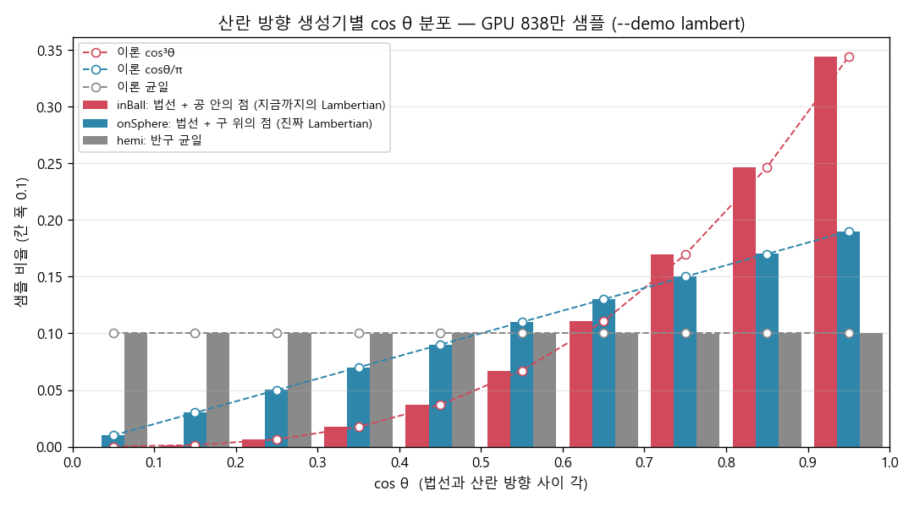

# Light Scattering (빛의 산란) — CUDA 적용판

> *Ray Tracing: The Rest of Your Life* 5장을 우리 **CUDA + 레이트레이싱 프로젝트** 기준으로 정리한 문서.
> 원서의 논지를 빠짐없이 따라가되 설명은 우리 말로 다시 썼다. 원서 5장은 코드가 없는 "수식 준비" 장이라, 우리는 그 수식을 GPU 데모로 **숫자로 검증**했다.
> 원서: <https://raytracing.github.io/books/RayTracingTheRestOfYourLife.html> (v4.0.2) · 코드 커밋 `405dacf`

---

> 💡 **이 장에서 CUDA 때문에 달라지는 큰 그림**
> 1. 원서 5장은 렌더러 코드를 바꾸지 않는다. 우리는 `--demo lambert`로 (1) Lambertian 산란 PDF의 정규화, (2) 산란 방향 생성기의 실제 분포를 확인했다.
> 2. **핵심 발견**: 지금까지 우리 렌더러의 `Lambertian`(법선 + *단위 공 안*의 점)은 cosθ/π가 아니라 **cos³θ 분포**였다. 진짜 Lambertian은 법선 + *단위 구 위*의 점이다. 6장에서 바로잡는다.
> 3. GPU 기법: 히스토그램을 **공유 메모리에 먼저 모았다가(사유화)** 블록당 한 번씩 전역에 더한다.

---

## 이 장에서 하는 일

이 장에서는 **코드를 한 줄도 쓰지 않는다.** 다음 장의 큰 조명 변경을 위한 준비만 한다.

1·2권의 레이트레이서는 레이가 표면이나 볼륨과 만나면 **산란**시켰다. 레이 산란은 장면 안에서 빛이 퍼지는 과정을 흉내 내는 가장 흔한 모델이고, 그 본성상 **확률적으로 모델링하기에 자연스럽다.** 다만 확률적으로 다루려면 따져야 할 것이 꽤 많다. 하나씩 보자.

---

## 알베도 (Albedo)

빛이 표면이나 매질을 만나면 가장 먼저 정해지는 것은 **흡수되느냐, 산란되느냐**다. 산란될 확률을 **알베도(albedo)** A라 하면 흡수될 확률은 1 − A다. 1권에서 본 "반사율의 한 형태"로서의 알베도가 바로 이것이다.

빛의 전파를 시뮬레이션한다는 것은 결국 **광자들의 움직임**을 흉내 내는 일이다. 광자 하나의 에너지는 파장으로 정해진다($E = hc/\lambda$). 하나하나는 아주 작지만 충분히 모이면 장면 전체의 조명이 된다. 광자가 흡수될지 산란될지는 알베도로 확률적으로 정해지고, 물체가 특정 파장을 더 잘 흡수할 수 있으므로 **알베도는 색(파장)에 따라 달라질 수 있다**. 우리 코드의 `attenuation`(RGB 감쇠)이 그 역할이다.

물리 기반 렌더러는 RGB 대신 정해진 파장들(예: 300nm, 350nm, …, 700nm)을 샘플링하기도 한다. RGB는 사람 눈의 세 가지 원뿔세포(장·중·단파장에 민감한 L/M/S)를 흉내 낸 근사로, R은 "대부분 빨간 파장", G는 "대부분 초록 파장"… 식의 혼합이라고 생각하면 된다.

## 산란 (Scattering)

빛이 산란된다면, 어느 방향으로 나갈지는 **입체각 위의 확률 분포**로 표현할 수 있다. 이것을 **산란 PDF**, $\operatorname{pScatter}$라 부르자. 이 분포는 여러 가지에 따라 달라질 수 있다.

- **나가는 방향** $\omega_o$ — 기본.
- **들어오는 방향** $\omega_i$ — 도로를 비스듬히 보면 거울처럼 반사되는 것처럼, 입사각에 따라 분포가 바뀐다.
- **파장** $\lambda$ — 프리즘이 흰빛을 무지개로 나누는 것처럼.
- **위치** $\mathbf{x}$ — 표면의 어느 점이냐에 따라.

알베도도 같은 변수들에 의존할 수 있다: $A(\mathbf{x}, \omega_i, \omega_o, \lambda)$.

표면에서 나가는 색은 들어오는 모든 방향에 대해 이 항들을 적분한 것이다.

$$ \operatorname{Color}_o(\mathbf{x}, \omega_o, \lambda) = \int_{\omega_i} A(\mathbf{x}, \omega_i, \omega_o, \lambda)\cdot\operatorname{pScatter}(\mathbf{x}, \omega_i, \omega_o, \lambda)\cdot\operatorname{Color}_i(\mathbf{x}, \omega_i, \lambda) $$

알베도와 산란 PDF는 그 점에 들어오는 빛에 대한 **필터** 역할을 한다. 그러니 들어오는 빛 $\operatorname{Color}_i$를 먼저 알아야 하고, 그것은 다시 다른 점에서 나가는 빛이다 — **재귀**다. 우리 `RayColor`가 "현재 물체의 감쇠 × 다음 레이의 색"을 계산하는 이유가 이것이다(우리는 반복문으로 펼쳐 `throughput`에 감쇠를 곱해 간다).

## 산란 PDF (The Scattering PDF)

3장의 몬테카를로 기본식을 적용하면 통계적 추정은 다음과 같다. $p$는 우리가 실제로 방향을 뽑은 분포의 밀도다.

$$ \operatorname{Color}_o \approx \sum \frac{A(\ldots)\cdot\operatorname{pScatter}(\ldots)\cdot\operatorname{Color}_i(\ldots)}{p(\mathbf{x}, \omega_i, \omega_o, \lambda)} $$

**Lambertian** 표면의 산란 PDF는 $\cos\theta_o$ 에 비례한다. 여기서 $\theta_o$ 는 법선과 나가는 방향 사이의 각이고 $[0, \pi]$ 범위다 — 0이면 법선과 같은 방향, $\pi$면 법선의 정반대 방향이다.

$$ \operatorname{pScatter}(\mathbf{x}, \omega_i, \omega_o, \lambda) = C\cdot\cos\theta_o $$

이제 상수 $C$ 를 정한다. 2차원 PDF는 모두 전체 면에서 적분하면 1이어야 한다($\operatorname{pScatter}$도 PDF다). 그리고 **수평선 아래로는 산란하지 않도록** $\operatorname{pScatter}(\tfrac{\pi}{2} < \theta_o \le \pi) = 0$ 으로 둔다. 그러므로 적분은 $\theta \in [0, \tfrac{\pi}{2}]$ 만 하면 된다.

$$ 1 = \int_{\phi=0}^{2\pi}\!\!\int_{\theta=0}^{\pi/2} C\cdot\cos\theta\;dA $$

구면 좌표에서 넓이 조각은 $dA = \sin\theta\,d\theta\,d\phi$ 이므로

$$ 1 = C\int_0^{2\pi}\!\!\int_0^{\pi/2}\cos\theta\,\sin\theta\,d\theta\,d\phi = C\cdot 2\pi\cdot\frac{1}{2} = C\pi \;\Longrightarrow\; C = \frac{1}{\pi} $$

바꿔 말하면 **반구에서 $\cos\theta_o$ 를 적분하면 $\pi$** 이고, 그래서 $1/\pi$ 로 정규화해야 한다는 뜻이다. $\operatorname{pScatter}$는 결국 나가는 방향에만 의존하므로 표기를 $\operatorname{pScatter}(\omega_o)$ 로 줄이면

$$ \operatorname{pScatter}(\omega_o) = \frac{\cos\theta_o}{\pi} $$

이제 방향을 **산란 PDF와 똑같은 분포로** 뽑는다고 하자($p = \operatorname{pScatter}$). 그러면 분자와 분모가 약분되어

$$ \operatorname{Color}_o \approx \sum A(\ldots)\cdot\operatorname{Color}_i(\ldots) $$

만 남는다. 이것이 1·2권 내내 써 온 "감쇠 × 다음 레이의 색"이다. 우리 코드로는 이 한 줄이다.

> 📄 **파일: `kernel.cu`** *(`RayColor`, 3권 5장 시점)*

```cpp
throughput = throughput * attenuation;   // A * pScatter / p 에서 pScatter / p = 1 이 약분된 모습
currentRay = scattered;
```

> 📝 **BRDF와의 관계**: 문헌에서는 반사를 보통 **BRDF**(양방향 반사율 분포 함수)로 정의한다. 우리 항들로 쓰면 $\operatorname{BRDF} = A\cdot\operatorname{pScatter}/\cos\theta_o$ 이고, Lambertian이면 $A/\pi$ 다. 원서가 BRDF 대신 "알베도 × 산란 PDF"로 설명하는 이유는 같은 수식을 표면과 볼륨에 함께 쓰고 싶어서다. 볼륨(참여 매질)에서는 알베도를 **산란 알베도**, 산란 PDF를 **위상 함수(phase function)** 라 부른다 — 2권 9장의 `Isotropic`이 바로 균일한 위상 함수다.

지금까지는 Lambertian 산란 하나의 PDF를 적은 것뿐이다. 다음 장부터는 이것을 일반화해서 **중요한 방향**(예: 광원 쪽)으로 레이를 더 보낼 수 있게 만든다.

---

## 수치로 확인하기: `--demo lambert` (우리가 덧붙인 실험)

원서 5장의 수식을 두 가지로 확인했다. 법선은 +z로 고정했다(그러면 $\cos\theta$ = 방향의 z성분).

### (1) 정규화: 반구에서 cosθ/π의 적분 = 1

구 전체에서 균일하게 방향을 뽑고($p = 1/4\pi$), $f = \max(0, \cos\theta)/\pi$ 를 p로 나눠 평균낸다.

> 📄 **파일: `MonteCarloDemo.cu`**

```cpp
__global__ void LambertNormalizationKernel(
	unsigned long long seed, int numThreads, int samplesPerThread, double* partialSums)
{
	int id = blockIdx.x * blockDim.x + threadIdx.x;
	if (id >= numThreads) return;

	DemoRng rng;
	curand_init(seed, id, 0, &rng);

	double sum = 0.0;
	for (int k = 0; k < samplesPerThread; k++)
	{
		int tries;
		double c = RandomUnitVectorRejection(&rng, tries).Z();
		double pScatter = (c > 0.0) ? c / kPi : 0.0;   // 수평선 아래로는 산란하지 않는다
		sum += pScatter * (4.0 * kPi);                 // f / p,  p = 1/(4 pi)
	}
	partialSums[id] = sum;
}
```

```text
[lambert] (1) integral of pScatter = cos(theta)/pi over the hemisphere, N = 8388608
  Estimate = 0.999372367   (should be 1)
```

### (2) 우리 Lambertian은 정말 cosθ/π 분포인가?

산란 방향을 만드는 세 가지 방법의 $\cos\theta$ 분포를 히스토그램으로 비교했다.

| 생성기 | 방법 | 어디서 쓰나 |
|---|---|---|
| `inBall` | 법선 + **단위 공 안**의 무작위 점 | 지금까지 우리 렌더러의 `Lambertian` (`RandomInUnitSphere`) |
| `onSphere` | 법선 + **단위 구 위**의 무작위 점 | 원서 v4의 `lambertian` (`random_unit_vector`) |
| `hemi` | 반구에서 균일한 방향 | 비교용 |

히스토그램은 CUDA의 기본 패턴대로 만든다. 모든 스레드가 전역 칸 10개에 바로 `atomicAdd` 하면 주소 10개에 경합이 몰리므로, **블록 전용 히스토그램을 공유 메모리에 먼저 모았다가**(사유화, privatization) 블록마다 한 번씩 전역에 더한다.

> 📄 **파일: `MonteCarloDemo.cu`**

```cpp
__global__ void CosineHistogramKernel(
	unsigned long long seed, int generator, int numThreads, int samplesPerThread,
	unsigned long long* bins, double* partialCosSums)
{
	__shared__ unsigned int localBins[kCosBins];     // 블록 전용 히스토그램
	for (int b = threadIdx.x; b < kCosBins; b += blockDim.x)
		localBins[b] = 0;
	__syncthreads();

	int id = blockIdx.x * blockDim.x + threadIdx.x;
	if (id < numThreads)
	{
		DemoRng rng;
		curand_init(seed, id, 0, &rng);

		double cosSum = 0.0;
		for (int k = 0; k < samplesPerThread; k++)
		{
			double c = ScatterDirection(generator, &rng).Z();   // 법선이 +z라 cos(theta) = z
			cosSum += c;

			int bin = int(c * kCosBins);
			if (bin < 0) bin = 0;
			if (bin >= kCosBins) bin = kCosBins - 1;
			atomicAdd(&localBins[bin], 1u);                   // 공유 메모리 원자 연산(빠름)
		}
		partialCosSums[id] = cosSum;
	}
	__syncthreads();

	for (int b = threadIdx.x; b < kCosBins; b += blockDim.x)
		atomicAdd(&bins[b], (unsigned long long)localBins[b]);   // 블록당 칸마다 1번
}
```

결과(각 생성기 838만 샘플, 오른쪽 세 열은 이론값):

```text
cos(theta)      inBall  onSphere      hemi  |    cos/pi     cos^3   uniform
[0.0, 0.1)     0.0001    0.0100    0.1001  |    0.0100    0.0001    0.1000
[0.1, 0.2)     0.0015    0.0301    0.1001  |    0.0300    0.0015    0.1000
[0.2, 0.3)     0.0065    0.0501    0.1000  |    0.0500    0.0065    0.1000
[0.3, 0.4)     0.0176    0.0700    0.0998  |    0.0700    0.0175    0.1000
[0.4, 0.5)     0.0370    0.0899    0.1001  |    0.0900    0.0369    0.1000
[0.5, 0.6)     0.0671    0.1100    0.1000  |    0.1100    0.0671    0.1000
[0.6, 0.7)     0.1105    0.1299    0.1000  |    0.1300    0.1105    0.1000
[0.7, 0.8)     0.1694    0.1500    0.0999  |    0.1500    0.1695    0.1000
[0.8, 0.9)     0.2464    0.1702    0.1000  |    0.1700    0.2465    0.1000
[0.9, 1.0)     0.3440    0.1899    0.1000  |    0.1900    0.3439    0.1000
mean cos        0.8000    0.6666    0.4999  |    0.6667    0.8000    0.5000
```



- `onSphere`는 이론 **cosθ/π**와 칸마다 일치한다(평균 cos = 2/3). 이것이 진짜 Lambertian이다.
- `inBall`은 cosθ/π가 아니라 **cos³θ**와 칸마다 일치한다(평균 cos = 0.8). 법선 쪽으로 훨씬 몰려 있다.

왜 cos³일까? 원점(표면 위의 점)은 "법선만큼 떨어진 곳을 중심으로 하는 단위 공"의 표면 위에 있다. 공 안에서 균일하게 뽑은 점의 **방향**만 보면, 방향 θ로 공을 가로지르는 현의 길이가 $2\cos\theta$라서 그 방향의 원뿔 조각 부피가 $\int_0^{2\cos\theta} r^2\,dr \propto \cos^3\theta$ 가 된다. 반면 공 **표면** 위의 점만 쓰면 정확히 $\cos\theta/\pi$가 나온다.

> ⚠️ **왜 지금 중요한가**: 원서 v4의 1권은 이미 "구 위의 점"(`random_unit_vector`)으로 진짜 Lambertian을 쓴다. 우리 CUDA 포팅은 예전 방식(공 안의 점)을 따라 왔다. 지금까지는 "감쇠만 곱하는" 구조라 아무 문제가 드러나지 않았지만, **6장에서 `ScatteringPdf = cos/π`를 정의하는 순간 실제 샘플 분포(cos³)와 PDF(cos)가 어긋난다**. 그래서 6장에서 `Lambertian`을 "구 위의 점"으로 바로잡는다. 겉보기에는 법선 쪽 편향이 줄어 음영이 조금 달라진다.

---

## 결과 & 검증

- **빌드/실행 확인**: VS2022 + CUDA 12.9 Release로 컴파일·링크·실행 성공.
- **정규화**: $\int_{hemisphere}\cos\theta/\pi\,d\omega$ = 0.99937 (N = 838만).
- **분포 확인**: `onSphere` = cosθ/π, `inBall` = cos³θ, `hemi` = 균일 — 세 가지 모두 이론 칸 확률과 소수점 넷째 자리까지 일치.

### 변경 파일 요약

| 원서 | 우리 파일 | 메모 |
|---|---|---|
| (5장은 코드 없음) | `MonteCarloDemo.cu` | `--demo lambert`: `LambertNormalizationKernel` |
| — | `MonteCarloDemo.cu` | `CosineHistogramKernel`(공유 메모리 히스토그램), `ScatterDirection` 생성기 3종 |

### CUDA 적용에서 꼭 기억할 3가지

1. **수식은 숫자로 확인하자**: 정규화(적분 = 1)와 분포 모양을 GPU로 몇 초 만에 검증할 수 있다. "그럴듯한 그림이 나오는 버그"는 그림만 봐서는 못 찾는다.
2. **"공 안의 점"과 "구 위의 점"은 다른 분포다**: 법선 + 공 안 = cos³, 법선 + 구 위 = cos/π(Lambertian). PDF를 쓰기 시작하면 이 차이가 곧 편향이 된다.
3. **히스토그램은 공유 메모리 사유화**: 블록 안에서 먼저 모으고 전역에는 블록당 한 번만 더해 원자 연산 경합을 줄인다.
