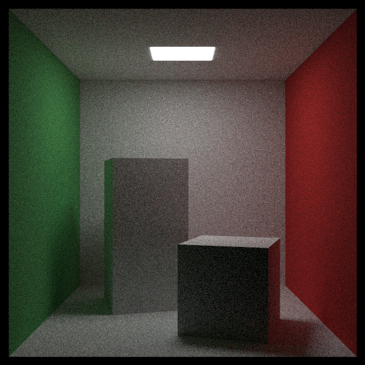
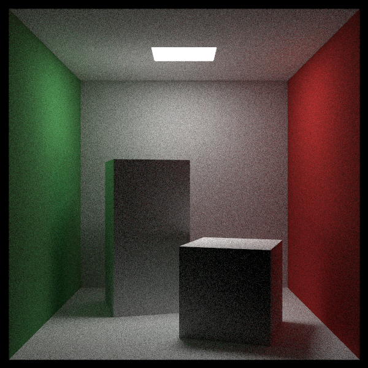
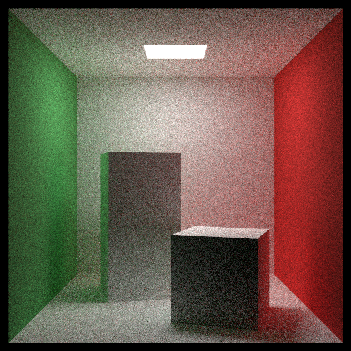
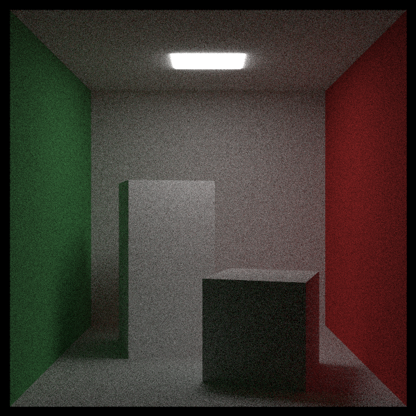

# Playing with Importance Sampling (중요도 샘플링 가지고 놀기) — CUDA 적용판

> *Ray Tracing: The Rest of Your Life* 6장을 우리 **CUDA + 레이트레이싱 프로젝트** 기준으로 정리한 문서.
> 원서의 논지를 빠짐없이 따라가되 설명은 우리 말로 다시 썼고, 코드는 전부 우리 GPU 코드다. 실제로 빌드·실행해 이미지와 수치를 확인했다.
> 원서: <https://raytracing.github.io/books/RayTracingTheRestOfYourLife.html> (v4.0.2) · 코드 커밋 `7dfc6a3`

---

> 💡 **이 장에서 CUDA 때문에 달라지는 큰 그림**
> 1. `Material::ScatteringPdf`를 추가하고 Lambertian은 cosθ/π를 돌려준다. 반복형 `RayColor`는 매 바운스마다 **감쇠 × pScatter / pdf** 를 `throughput`에 곱한다.
> 2. 5장에서 찾은 문제대로 **Lambertian 산란을 "구 위의 점"으로 교정**했다(진짜 cosθ/π). 코넬 박스 밝기가 달라진다(선형 평균 0.0975 → 0.0784).
> 3. `ScatteringPdf`를 정의하지 않은 재질(Metal/Dielectric/Isotropic)은 **감쇠만 곱한다**. 원서는 이 시점에 거울·유리가 깨지고 12장에서 고치지만, 우리는 미리 막아서 1·2권 장면이 계속 동작한다.
> 4. ⚠️ 원서 "균일 PDF" 절의 코드를 그대로 쓰면 **편향된다**(바운스마다 4/3배). 화로 테스트(`--demo furnace`)와 렌더로 확인했고, 우리는 방향도 균일하게 뽑아 바르게 실험했다.
> 5. 3권 장면 기본 샘플 수는 원서처럼 1000(층화 31×31 = 961). RTX 5070 Ti에서 약 32초.

---

## 이번 장의 목표: 광원 쪽으로 레이를 더 보내기

앞으로 몇 장에 걸쳐 할 일은 **광원 쪽으로 레이를 더 많이 보내서** 노이즈를 줄이는 것이다. 광원 쪽으로 향하는 PDF를 $\operatorname{pLight}$, 표면의 산란과 관련된 PDF를 $\operatorname{pSurface}$라 하자. PDF의 좋은 성질 하나는 **양수 가중치의 합이 1인 선형 결합도 PDF**라는 것이다. 가장 단순한 예는 반반 섞기다.

$$ p(\omega_o) = \frac{1}{2}\operatorname{pSurface}(\omega_o) + \frac{1}{2}\operatorname{pLight}(\omega_o) $$

어떤 PDF를 써도 결국 정답에 수렴한다(3장). 그러니 요령은 $\operatorname{pScatter}\cdot\operatorname{Color}_i$ 가 큰 곳에서 PDF가 크도록 만드는 것이다. 난반사 표면이라면 "빛이 어디서 가장 많이 오는가"를 추측하는 문제가 된다. 거울은 반대로 $\operatorname{pScatter}$ 자체가 한 방향에서만 커서 그쪽이 훨씬 중요하다. 대부분의 렌더러는 거울을 아예 특수 처리해서 $\operatorname{pScatter}/p$ 계산을 건너뛴다 — 우리 코드도 그렇게 한다(아래).

---

## 코넬 박스로 돌아가기 — 1000 spp 기준 이미지

원서처럼 샘플 수를 1000으로 올려 기준 이미지를 만든다. 원서는 600×600을 CPU 한 코어로 15분쯤 걸렸다고 한다. 우리는 **RTX 5070 Ti에서 약 32초**(31×31 = 961 spp, 층화).




이 노이즈를 줄이는 것이 목표다. 먼저 코드가 **어떤 PDF로 샘플링했는지를 명시적으로 알고, 그 PDF로 나누도록** 계측(instrument)한다. 몬테카를로 기본식 $\int f(x)\,dx \approx \sum f(r)/p(r)$ 을 산란에 적용하는 것이다. Lambertian은 지금처럼 $p(\omega_o) = \cos\theta_o/\pi$ 로 뽑는다.

### 코드: `ScatteringPdf`와 `RayColor`

재질 기본 클래스에 산란 PDF를 묻는 함수를 추가하고, Lambertian이 cosθ/π를 돌려주게 한다.

> 📄 **파일: `Material.h`** — 원서 Listing `class-lambertian-impsample`에 대응

```cpp
class Material
{
public:
    /* ... Emitted, Scatter ... */

    // 이 재질이 scattered 방향으로 빛을 보낼 확률 밀도(입체각 기준).
    // 기본값 0 = "정의하지 않음". Metal/Dielectric처럼 방향이 사실상 하나로 정해지는
    // (PDF가 델타 함수인) 재질은 f/p로 나눌 수 없으므로, RayColor가 이 경우 감쇠만 곱한다.
    __device__ virtual double ScatteringPdf(
        const Ray& rayIn, const HitRecord& rec, const Ray& scattered) const
    {
        return 0.0;
    }
};

class Lambertian : public Material
{
public:
    __device__ bool Scatter(
        const Ray& rayIn, const HitRecord& rec,
        Color& attenuation, Ray& scattered, curandState* randState) const override
    {
        // 법선 + "단위 구 위의" 무작위 점 → 진짜 cos/pi 분포 (3권 5장)
        Vector3 scatterDirection = rec.Normal + RandomUnitVector(randState);
        if (scatterDirection.NearZero())
            scatterDirection = rec.Normal;

        scattered = Ray(rec.P, scatterDirection, rayIn.Time());
        attenuation = mTexture->Value(rec.U, rec.V, rec.P);
        return true;
    }

    // pScatter = cos(theta) / pi (수평선 아래는 0)
    __device__ double ScatteringPdf(
        const Ray& rayIn, const HitRecord& rec, const Ray& scattered) const override
    {
        double cosTheta = Dot(rec.Normal, UnitVector(scattered.Direction()));
        return cosTheta < 0.0 ? 0.0 : cosTheta / kPi;
    }
    /* ... */
};
```

원서의 재귀식은 "방출 + 감쇠 × pScatter × (다음 레이의 색) / pdf" 다. 우리 `RayColor`는 재귀를 반복문으로 펼쳐 두었으므로(2권 7장), **다음 레이의 색에 곱해질 계수 전체**를 `throughput`에 곱해 두면 같은 식이 된다.

> 📄 **파일: `kernel.cu`** *(`RayColor`)* — 원서 Listing `ray-color-impsample`에 대응

```cpp
Ray scattered;
Color attenuation;
if (!rec.MaterialPtr->Scatter(currentRay, rec, attenuation, scattered, randState))
	return accumulated;

// 색_o = 방출 + 감쇠 * pScatter(방향) * 색_i / pdfValue(방향)
double scatteringPdf = rec.MaterialPtr->ScatteringPdf(currentRay, rec, scattered);
if (scatteringPdf > 0.0)
{
	double pdfValue = scatteringPdf;   // 지금은 pScatter와 같은 분포로 뽑는다
	throughput = throughput * attenuation * (scatteringPdf / pdfValue);
}
else
{
	// ScatteringPdf가 없는 재질(Metal/Dielectric/Isotropic): 원서 12장의 skip_pdf처럼 감쇠만
	throughput = throughput * attenuation;
}
currentRay = scattered;
```

`pdfValue == scatteringPdf`라 곱해지는 값은 결국 감쇠뿐이다. 그래서 **그림은 바뀌지 않아야 정상**이다(수학적으로 1을 곱한 것).

> 🔧 **원서와 다른 점 — 거울·유리를 미리 지킨다**: 원서는 모든 재질에 `scattering_pdf / pdf_value`를 곱하므로, `scattering_pdf`가 0인 금속·유리는 이 시점부터 0/0이 되어 깨진다(원서 11장이 "specular를 망가뜨렸다"고 인정하고 12장에서 고친다). 우리는 **`ScatteringPdf`가 0이면 감쇠만 곱하는** 규칙을 먼저 넣어서, 1·2권 장면(금속·유리·연기)이 계속 예전처럼 렌더된다. 12장의 `skip_pdf`를 미리 당겨 온 셈이다.

### Lambertian 교정의 효과 (5장 발견 반영)

5장에서 확인했듯이 지금까지의 "법선 + 공 안의 점"은 cos³θ 분포였다. `ScatteringPdf = cos/π`와 짝을 맞추려고 "법선 + 구 위의 점"으로 바꿨다. 같은 961 spp로 비교하면:




교정 전 그림이 전체적으로 더 밝다(선형 평균 0.0975 vs 0.0784). cos³ 생성기에서 감쇠만 곱하는 것은, 사실상 **법선 방향으로 빛을 더 몰아 보내는 다른 재질**(BRDF $\propto \cos^2\theta$)을 쓴 것과 같다. 천장 광원을 정면으로 보는 바닥 같은 면이 광원을 더 자주 맞혀서 밝아진다. 에너지는 보존되지만 Lambertian은 아니었던 것이다. 원서 이미지 3과 비교하면 교정 후 쪽이 맞다.

---

## 완벽한 PDF 대신 균일 PDF 쓰기

경험 삼아 **재질은 그대로(Lambertian, pScatter = cos/π)** 두고, 방향을 뽑는 PDF만 바꿔 보자. 반구에서 균일하게 뽑으면 $p = 1/2\pi$ 다. PDF가 피적분 함수와 덜 닮았으니 수렴은 느려지지만(같은 샘플 수면 노이즈 증가), **답은 같아야** 한다.

> ⚠️ **원서 코드 그대로 하면 편향된다**: 원서 Listing `ray-color-uniform`은 분모(`pdf_value`)만 $1/2\pi$로 바꾸고, 방향은 여전히 Lambertian(cos 분포)으로 뽑는다. 그러면 "실제로 뽑은 분포"와 "나눈 PDF"가 어긋나서, 한 바운스마다 기댓값이 $2\,E[\cos\theta] = 2\cdot\tfrac{2}{3} = \tfrac{4}{3}$배가 된다. 화로 테스트(사방에서 밝기 1의 빛, 알베도 A = 0.73 → 반사광은 정확히 A여야 함)로 확인했다.
>
> ```text
> [furnace] white furnace test: albedo A = 0.73, incoming radiance L = 1 from every direction
> case                                                estimate    expected   stddev/sample
> cos-sampled,     pdf = cos/pi                       0.730000    0.730000        0.000000
> uniform-sampled, pdf = 1/2pi                        0.729875    0.730000        0.421430
> cos-sampled,     pdf = 1/2pi  (book listing)        0.973303    0.973333        0.344068
> hemispherical material, pScatter = pdf = 1/2pi      0.730000    0.730000        0.000000
> ```
>
> **pdf에는 반드시 "방향을 실제로 뽑은 분포의 밀도"를 넣어야 한다.** 그래서 우리는 방향도 반구 균일로 뽑아서 실험했다.

> 📄 **실험용 임시 코드** (이미지 생성에만 쓰고 **커밋하지 않음**)

```cpp
// Lambertian::Scatter — 반구에서 균일하게 방향을 뽑는다
Vector3 u = RandomUnitVector(randState);
if (Dot(u, rec.Normal) < 0.0)
    u = -u;
scatterDirection = u;

// RayColor — 실제로 뽑은 분포(반구 균일)의 밀도로 나눈다 (pScatter는 그대로 cos/pi)
double pdfValue = 1.0 / (2.0 * kPi);
```




- 바른 실험: 밝기는 기준 이미지와 **같고**(선형 평균 0.0783 vs 0.0784), 노이즈만 **늘었다**(뒷벽 표준편차 21.3 vs 17.3).
- 원서 코드 그대로: 한 바운스에 4/3배가 여러 번 겹쳐 **2.2배 밝아졌다**(선형 평균 0.1727). "그럴듯하지만 틀린" 그림의 전형이다.

실험이 끝나면 PDF를 다시 산란 PDF로 되돌린다(`pdfValue = scatteringPdf`). 커밋된 코드는 되돌린 상태다.

---

## 반구 균일 산란 (Random Hemispherical Sampling)

이번에는 **재질 자체를 바꿔** 보자. 1권 초반에 잠깐 썼던 "반구 균일 난반사"다. 이것도 난반사의 한 종류지만 Lambertian은 아니다(Lambertian은 반드시 cosθ 분포). 산란 방향도, 산란 PDF도 $1/2\pi$로 바꾼다.

> 📄 **실험용 임시 코드** (커밋하지 않음)

```cpp
// Lambertian::Scatter — 반구 균일
Vector3 u = RandomUnitVector(randState);
if (Dot(u, rec.Normal) < 0.0)
    u = -u;
scatterDirection = u;

// Lambertian::ScatteringPdf — 이 재질의 산란 PDF 자체가 균일
return 1.0 / (2.0 * kPi);
```

이 재질에는 균일 PDF가 "완벽한 짝"이다(pScatter = p). 하지만 재질이 바뀌었으니 **다른 답**으로 수렴한다.




기준 이미지와 비슷해 보이지만 노이즈가 아닌 차이가 있다. 전체가 조금 어둡고(선형 평균 0.0666), **키 큰 상자 앞면의 밝기가 더 고르다**. 화로 테스트에서는 이 재질도 에너지를 정확히 보존(0.73)하므로, 차이는 "빛이 고르지 않은 실제 장면"에서만 드러난다.

여기서 얻는 교훈:

- **PDF를 잘못 고르면** 수렴이 느려질 뿐 결국 정답에 간다(렌더를 망치지는 않는다).
- **산란 함수(재질)를 잘못 고르면** 다른 답에 수렴한다. 몬테카를로에서 가장 찾기 어려운 버그는 "그럴듯한 그림이 나오는 버그"다 — 5장의 cos³ Lambertian, 위의 편향된 균일 PDF가 모두 그랬다. 이런 버그는 첫 번째 버전이 틀렸는지, 두 번째가 틀렸는지, 아니면 둘 다인지조차 알기 어렵다.

실용적인 조언으로 옮기면 이렇다. **재질에 어떤 샘플링 패턴이 가장 좋은지 모르겠다면 그냥 균일 PDF를 가정해도 괜찮다** — 수렴이 느릴 뿐 렌더를 망치지는 않는다. 반면 **산란 함수 자체를 잘못 고르면 반드시 틀린 결과가 나온다.** 즉 걱정해야 할 순서는 "PDF 선택"이 아니라 "산란 함수가 맞는가"다.

그래서 다음 장부터는 방향 생성과 PDF를 제대로 다룰 **기반 코드**를 만든다.

---

## 결과 & 검증

- **빌드/실행 확인**: VS2022 + CUDA 12.9 Release로 컴파일·링크·실행 성공. 961 spp 600×600 렌더 약 32~38초.
- **`--demo furnace`**: cos/cos, 균일/균일, 반구 균일 재질은 정확히 A = 0.73. 원서 코드 그대로(cos로 뽑고 1/2π로 나눔)는 0.9733 = 4A/3.

| 이미지 | 설정 | 선형 평균 밝기 | 뒷벽 표준편차 |
|---|---|---|---|
| 기준 (커밋된 코드) | 구 위의 점, pdf = pScatter = cos/π | 0.0784 | 17.3 |
| 교정 전 | 공 안의 점(cos³), pdf = pScatter | 0.0975 | 20.1 |
| 균일 PDF (바른 실험) | 반구 균일로 뽑음, pdf = 1/2π | 0.0783 | 21.3 |
| 균일 PDF (원서 코드) | cos로 뽑음, pdf = 1/2π | 0.1727 | 23.1 |
| 반구 균일 재질 | pScatter = pdf = 1/2π | 0.0666 | 15.8 |

### 변경 파일 요약

| 원서 Listing | 우리 파일 | 메모 |
|---|---|---|
| `cornell-box` (1000 spp) | `kernel.cu` (`main`) | 3권 장면 기본 1000 spp (31×31 = 961) |
| `class-lambertian-impsample` | `Material.h` | `Material::ScatteringPdf`(기본 0), Lambertian은 cos/π |
| — | `Material.h` | `RandomUnitVector`, Lambertian 생성기 교정(구 위의 점), `kPi` |
| `ray-color-impsample` | `kernel.cu` (`RayColor`) | throughput에 감쇠 × pScatter / pdf, PDF 없는 재질은 감쇠만 |
| `ray-color-uniform`, `scatter-mod` | (실험용, 커밋 안 함) | 반구 균일 샘플링 / 반구 균일 재질 |
| — | `MonteCarloDemo.cu` | `--demo furnace`: 화로 테스트 |

### CUDA 적용에서 꼭 기억할 3가지

1. **반복형 RayColor에서는 f/p를 throughput에 곱한다**: 재귀식의 "감쇠 × pScatter / pdf"가 그대로 다음 바운스의 계수가 된다.
2. **pdf에는 실제로 뽑은 분포의 밀도**: 뽑는 코드와 나누는 PDF가 어긋나면 편향된다. 화로 테스트로 몇 초 만에 잡을 수 있다.
3. **델타 분포 재질은 나누지 말고 감쇠만**: `ScatteringPdf == 0`을 "PDF 없음"으로 약속해 금속·유리를 지켰다(12장 `skip_pdf`의 예고편).
