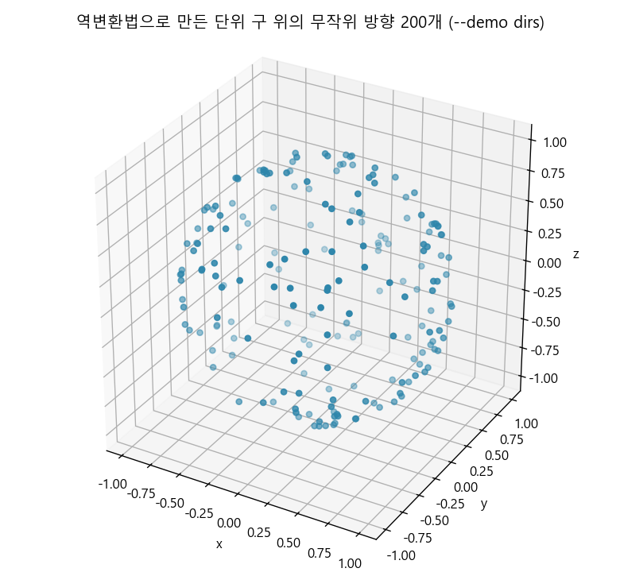

# Generating Random Directions (무작위 방향 만들기) — CUDA 적용판

> *Ray Tracing: The Rest of Your Life* 7장을 우리 **CUDA + 레이트레이싱 프로젝트** 기준으로 정리한 문서.
> 원서의 흐름(z축 기준 방향 → 균일 반구 → 코사인 반구)을 따라가되 설명은 요약·재구성했고, 코드는 전부 우리 GPU 코드다. 실제로 빌드·실행해 수치를 확인했다.
> 원서: <https://raytracing.github.io/books/RayTracingTheRestOfYourLife.html> (v4.0.2) · 코드 커밋 `a83ec5f`

---

> 💡 **이 장에서 CUDA 때문에 달라지는 큰 그림**
> 1. 렌더러에는 `RandomCosineDirection` 하나만 추가한다(실제로 쓰는 것은 8장). 실험은 `--demo dirs`.
> 2. 역변환법은 **루프가 없다** → 4장에서 본 워프 발산이 사라진다. 같은 1,677만 방향을 만드는 데 거절법 6.97 ms, 역변환법 3.18 ms로 **2.19배** 빨랐다.
> 3. ⚠️ 마이크로벤치마크 함정: 생성 결과를 일부만 쓰면 컴파일러가 나머지 계산을 지워 버린다. 처음에 z성분만 더했다가 **27배라는 엉터리 수치**가 나왔다.
> 4. 코사인 PDF는 cos³ 적분에서 샘플당 표준편차를 **1.78 → 0.91**로 줄인다. 중요도 샘플링의 맛보기다.

---

## z축 기준으로 방향 만들기

거절법(뽑고 버리기) 말고 3장의 **역변환법**으로 방향을 만들어 보자. 계산을 단순하게 하려고 **z축을 법선으로 두고**, z축에 대해 회전 대칭인 분포만 다룬다. 그러면 방향의 PDF는 θ만의 함수다: $p(\omega) = f(\theta)$.

이때 φ와 θ 각각의 1차원 PDF는 다음과 같다.

$$ a(\phi) = \frac{1}{2\pi}, \qquad b(\theta) = 2\pi f(\theta)\sin\theta $$

φ 쪽은 균일하므로 $r_1$을 그대로 늘리면 된다: $\phi = 2\pi r_1$. θ 쪽은 CDF를 적분해서 뒤집는다.

$$ r_2 = \int_0^{\theta} 2\pi f(\theta')\sin\theta'\,d\theta' $$

세 가지 분포에 대해 이 적분을 풀면 (θ를 직접 구하지 않고 **cos θ만** 구하는 것이 요령이다 — 어차피 직교 좌표로 바꿀 때 필요한 것은 cos θ와 sin θ뿐이라, `acos` 호출을 아낄 수 있다):

| 분포 | $f(\theta)$ | 결과 |
|---|---|---|
| 균일 구면 | $1/4\pi$ | $\cos\theta = 1 - 2r_2$ |
| 균일 반구 | $1/2\pi$ | $\cos\theta = 1 - r_2$ (수평선 아래로 가지 않음) |
| 코사인(Lambert) | $\cos\theta/\pi$ | $\cos\theta = \sqrt{1 - r_2}$, $\sin\theta = \sqrt{r_2}$ |

직교 좌표로는 공통이다.

$$ x = \cos\phi\,\sin\theta, \qquad y = \sin\phi\,\sin\theta, \qquad z = \cos\theta $$

> 📄 **파일: `MonteCarloDemo.cu`** — 원서 Listing `rand-unit-sphere-plot`, `random-cosine-direction`에 대응

```cpp
__device__ inline Vector3 RandomUnitVectorInversion(DemoRng* rng)
{
	double r1 = RandomDouble(rng);
	double r2 = RandomDouble(rng);
	double z = 1.0 - 2.0 * r2;                      // cos(theta)
	double r = sqrt(fmax(0.0, 1.0 - z * z));        // sin(theta)
	double phi = 2.0 * kPi * r1;
	return Vector3(cos(phi) * r, sin(phi) * r, z);
}

__device__ inline Vector3 RandomHemisphereDirectionInversion(DemoRng* rng)
{
	double r1 = RandomDouble(rng);
	double r2 = RandomDouble(rng);
	double z = 1.0 - r2;                            // cos(theta), [0,1] → 수평선 위쪽만
	double r = sqrt(fmax(0.0, 1.0 - z * z));
	double phi = 2.0 * kPi * r1;
	return Vector3(cos(phi) * r, sin(phi) * r, z);
}

__device__ inline Vector3 RandomCosineDirectionDemo(DemoRng* rng)
{
	double r1 = RandomDouble(rng);
	double r2 = RandomDouble(rng);
	double z = sqrt(1.0 - r2);                      // cos(theta)
	double r = sqrt(r2);                            // sin(theta) = sqrt(1 - z^2)
	double phi = 2.0 * kPi * r1;
	return Vector3(cos(phi) * r, sin(phi) * r, z);
}
```

원서는 이렇게 만든 점 200개를 plot.ly에 올려 구면에 고르게 퍼지는지 눈으로 확인한다. 우리도 `--demo dirs`가 점 200개를 CSV로 찍어 주고, 그것을 그대로 그렸다.



---

## 적분으로 검증하기

눈으로 보는 것보다 확실한 방법은 **답을 아는 적분**을 풀어 보는 것이다. 반구에서 cos³을 적분하면

$$ \int_{\text{hemi}} \cos^3\theta\,d\omega = \int_0^{2\pi}\!\!\int_0^{\pi/2}\cos^3\theta\,\sin\theta\,d\theta\,d\phi = 2\pi\cdot\frac{1}{4} = \frac{\pi}{2} $$

이고, 구 전체에서 cos²을 적분하면 4장에서 본 대로 $4\pi/3$이다. 같은 적분을 **다른 PDF**로 풀어 보면 중요도 샘플링의 효과가 숫자로 보인다(`--demo dirs`, 각 1,677만 샘플).

```text
[dirs] inversion-method directions, N = 16777216 per case
case                                      estimate           exact         |error|   stddev/sample
cos^2 over sphere,   p = 1/4pi         4.188496164     4.188790205     0.000294041     3.747001311
cos^3 over hemi,     p = 1/2pi         1.570411040     1.570796327     0.000385287     1.780752191
cos^3 over hemi,     p = cos/pi        1.570754462     1.570796327     0.000041865     0.906914153
```

- 셋 다 정답에 수렴한다(4장의 거절법 결과와도 일치).
- 같은 적분 $\pi/2$를 균일 반구로 풀면 샘플당 표준편차가 1.78, **코사인 분포로 풀면 0.91**이다. 분산은 표준편차의 제곱이므로 약 **3.9배** 작다 — 같은 노이즈를 얻는 데 샘플이 약 1/4만 있으면 된다는 뜻이다. 피적분 함수 $\cos^3$과 PDF $\cos$의 모양이 더 닮았기 때문이다.

---

## GPU 관점: 루프 없는 생성기의 값어치

4장에서 거절법의 실제 비용은 "워프 안 최대 시도 횟수"(레인 활용률 32%)라고 확인했다. 역변환법은 난수 두 개로 바로 계산하므로 **모든 레인이 정확히 같은 일을 같은 횟수만큼** 한다. 같은 개수의 방향을 만드는 시간을 CUDA 이벤트로 쟀다.

```text
generating 16777216 directions
  rejection method  :     6.97 ms   (  2.41 G dir/s)
  inversion method  :     3.18 ms   (  5.28 G dir/s)
  speedup           :     2.19x
```

역변환법은 `sin`, `cos`, `sqrt`를 (그것도 double로) 부르는데도 **2.19배 빠르다**. 거절법이 평균 1.91회 난수 3개를 뽑고, 워프는 그중 가장 느린 레인을 기다리기 때문이다.

> ⚠️ **마이크로벤치마크 함정 (실제로 겪음)**: 처음에는 생성한 방향의 **z성분만** 더해서 시간을 쟀다. 그랬더니 역변환법이 27배 빠르다고 나왔다. 이유는 간단하다 — 역변환법에서 z는 `1 - 2*r2` 라서, **컴파일러가 φ·sin·cos·sqrt 계산을 전부 죽은 코드로 보고 지워 버린다**. 거절법은 조건 검사에 x, y, z가 다 필요해서 지울 수 없으니 불공정한 비교가 된 것이다. 세 성분을 모두 더하도록 고치니 2.19배가 나왔다.
>
> ```cpp
> // 어느 쪽도 계산을 건너뛸 수 없게 세 성분을 모두 쓴다
> sum += d.X() + d.Y() + d.Z();
> ```
>
> GPU 마이크로벤치마크에서는 "결과를 반드시 소비하기"가 기본이고, **무엇을 소비하느냐**까지 신경 써야 한다.

---

## 렌더러에 들어간 것

이 장에서 렌더러에 추가하는 것은 코사인 분포 방향 생성기 하나다. 아직 z축 기준이라 그대로는 못 쓰고, 8장에서 정규직교 기저(ONB)로 실제 법선에 맞춰 돌린다.

> 📄 **파일: `Material.h`**

```cpp
// 거절법과 달리 루프가 없다. 난수 두 개로 바로 계산하므로 워프 안 모든 레인이
// 같은 시간에 끝난다(GPU에 유리).
//   phi = 2 pi r1,  cos(theta) = sqrt(1 - r2)  ← cos(theta)/pi 분포의 CDF를 뒤집은 것
__device__ inline Vector3 RandomCosineDirection(curandState* randState)
{
    double r1 = curand_uniform_double(randState);
    double r2 = curand_uniform_double(randState);

    double phi = 2.0 * kPi * r1;
    double z = sqrt(1.0 - r2);     // cos(theta)
    double r = sqrt(r2);           // sin(theta)

    return Vector3(cos(phi) * r, sin(phi) * r, z);
}
```

---

## 결과 & 검증

- **빌드/실행 확인**: VS2022 + CUDA 12.9 Release로 컴파일·링크·실행 성공.
- **적분 검증**: cos²(구) 4.188496 / cos³(반구) 1.570411(균일), 1.570754(코사인) — 모두 정답과 일치.
- **분산**: 코사인 PDF가 균일 PDF보다 샘플당 표준편차 약 절반(분산 약 1/4).
- **생성 비용**: 거절법 6.97 ms vs 역변환법 3.18 ms (1,677만 방향, 2.19배).

### 변경 파일 요약

| 원서 Listing | 우리 파일 | 메모 |
|---|---|---|
| `rand-unit-sphere-plot` | `MonteCarloDemo.cu` | `RandomUnitVectorInversion`, 점 200개 CSV 출력 |
| `cos-cubed` | `MonteCarloDemo.cu` | 균일 반구 PDF로 cos³ 적분 |
| `random-cosine-direction`, `cos-density` | `MonteCarloDemo.cu` | 코사인 분포 생성기와 그 PDF로 cos³ 적분 |
| — | `MonteCarloDemo.cu` | 거절법 vs 역변환법 생성 비용(CUDA 이벤트) |
| `random-cosine-direction` | `Material.h` | 렌더러용 `RandomCosineDirection` (8장에서 사용) |

### CUDA 적용에서 꼭 기억할 3가지

1. **역변환법은 GPU와 궁합이 좋다**: 루프가 없어 워프 발산이 없고, `acos` 없이 cos θ·sin θ만 구하면 된다. 실측 2.19배.
2. **벤치마크는 결과를 전부 소비하자**: 일부만 쓰면 컴파일러가 나머지를 지워 엉뚱한 수치(27배)가 나온다.
3. **PDF가 피적분 함수를 닮을수록 분산이 준다**: cos³ 적분에서 코사인 PDF가 분산을 약 1/4로 줄였다. 다음 장부터 이 원리를 광원 샘플링에 쓴다.
