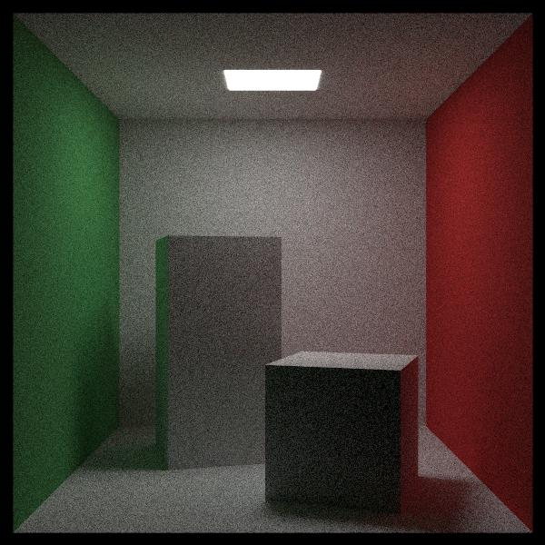

# Orthonormal Bases (정규직교 기저) — CUDA 적용판

> *Ray Tracing: The Rest of Your Life* 8장을 우리 **CUDA + 레이트레이싱 프로젝트** 기준으로 정리한 문서.
> 원서의 논지를 빠짐없이 따라가되 설명은 우리 말로 다시 썼고, 코드는 전부 우리 GPU 코드다. 실제로 빌드·렌더해서 결과가 8장 이전과 같은지 확인했다.
> 원서: <https://raytracing.github.io/books/RayTracingTheRestOfYourLife.html> (v4.0.2) · 코드 커밋 `6f46903`

---

> 💡 **이 장에서 CUDA 때문에 달라지는 큰 그림**
> 1. `Onb.h`를 새로 만든다. 힙을 쓰지 않는 작은 값 타입이라 **산란 함수 안에서 스택에 그대로** 만들어 쓴다(디바이스에서 `new` 금지).
> 2. `Material::Scatter`에 **`double& pdf` 출력 인자**가 붙는다. 재질이 "이 방향을 어떤 밀도로 뽑았는지"를 직접 알려주고, `RayColor`는 더 이상 그 값을 스스로 가정하지 않는다.
> 3. Metal/Dielectric은 `pdf = 0`(델타 분포), Isotropic은 `1/4π`를 돌려준다. 우리는 6장에서 만든 "pdf가 0이면 감쇠만" 규칙 덕분에 1·2권 장면이 계속 정상이다.
> 4. 결과 이미지는 6장과 **사실상 동일**(선형 평균 0.0783 vs 0.0784) — 리팩터링이 동작을 바꾸지 않았다는 확인이다.
> 5. ⚠️ 속도는 오히려 느려졌다(32.3초 → 40.9초). 원인을 측정으로 좁혀 봤고, 결론은 "8장의 이득은 속도가 아니라 **pdf를 정확히 아는 것**"이다(아래 측정 표).

---

## 왜 기저가 필요한가

7장에서 만든 방향들은 **z축이 법선**이라고 가정한 좌표계의 값이다. 하지만 반사를 아무 표면에서나 만들려면 이걸 일반화해야 한다 — **모든 법선이 z축과 나란할 리가 없기 때문이다.** 이 장에서는 임의의 법선 벡터를 지원하도록 방법을 확장한다.

### 상대 좌표 (Relative Coordinates)

**정규직교 기저(orthonormal basis, ONB)** 는 서로 수직인 단위 벡터 세 개의 모음이다. 좌표계의 한 종류라고 보면 되고, 우리가 늘 쓰는 데카르트 $xyz$ 축이 바로 그 예다.

왜 좌표계 이야기를 하냐면, 우리가 만드는 모든 렌더 결과는 결국 **장면 안 물체들의 상대적인 위치와 방향을 카메라의 이미지 평면에 투영한 것**이기 때문이다. 그러려면 카메라와 물체가 **같은 좌표계**로 기술되어야 한다. 그렇지 않으면 카메라는 물체를 어디에 그려야 할지 알 수 없다. 카메라를 물체의 좌표계로 다시 정의하든, 물체를 카메라의 좌표계로 다시 정의하든 해야 하는데, 애초에 둘을 같은 좌표계에 두면 그런 변환 자체가 필요 없다.

그런데 기저만으로는 부족하다. 기저는 "거리와 방향을 어떻게 표현할지"를 정할 뿐이고, 물체와 카메라는 **공통으로 정한 어떤 위치로부터의 변위**로 기술되어야 한다. 그것이 장면의 **원점** $\mathbf{O}$ 다 — 모든 것이 거기서부터 떨어진 만큼으로 표현되는, 이 세계의 중심이다.

원점 $\mathbf{O}$ 와 데카르트 단위 벡터 $\mathbf{x}, \mathbf{y}, \mathbf{z}$ 가 있다고 하자. 어떤 위치를 $(3, -2, 7)$ 이라고 말할 때 우리가 실제로 말하는 것은 이것이다.

$$ \mathbf{O} + 3\mathbf{x} - 2\mathbf{y} + 7\mathbf{z} $$

원점이 $\mathbf{O}'$ 이고 기저가 $\mathbf{u}, \mathbf{v}, \mathbf{w}$ 인 다른 좌표계에서 재고 싶다면, 같은 점을 나타내는 수 $(u, v, w)$ 를 찾으면 된다.

$$ \mathbf{O}' + u\,\mathbf{u} + v\,\mathbf{v} + w\,\mathbf{w} $$

### ONB 만들기

그래픽스 입문 수업이라면 여기서 좌표계와 4×4 변환 행렬에 꽤 많은 시간을 쓴다. 중요한 내용이지만 이 책에서는 필요하지 않다. 우리에게 필요한 것은 **법선 벡터 $\mathbf{n}$ 을 기준으로 정해진 분포의 무작위 방향을 만드는 것**뿐이고, **방향은 상대적인 양이라 원점이 아예 필요 없다.**

그러려면 $\mathbf{n}$ 에 수직이면서 서로도 수직인 **접선 벡터 두 개**가 있어야 한다.

3D 모델 중에는 정점마다 접선 벡터를 하나 이상 들고 오는 것도 있다. 하지만 접선이 하나뿐이라면 ONB를 만드는 일은 그리 단순하지 않고, 애초에 모델을 읽을 때 접선을 받지 못할 수도 있다. 우리 프로그램에는 접선을 만들어 낼 방법이 아직 없다.

그래서 흔히 쓰는 방법은 이렇다. $\mathbf{n}$ 과 나란하지 않고 길이가 0이 아닌 아무 벡터 $\mathbf{a}$ 를 고른다. 외적의 성질상 $\mathbf{n} \times \mathbf{a}$ 는 $\mathbf{n}$ 과 $\mathbf{a}$ 둘 다에 수직이므로, 이것으로 남은 두 축을 만들 수 있다.

문제는 $\mathbf{a}$ 를 아무렇게나 고르면 하필 $\mathbf{n}$ 과 나란해질 수 있다는 것이다(그러면 외적이 0벡터가 된다). 그래서 **축 하나를 고르되 $\mathbf{n}$ 과 나란한지 검사하고, 나란하면 다른 축을 쓴다.** $\mathbf{n}$ 이 단위 벡터라고 가정하면 검사는 간단하다 — $|\mathbf{n}_x| > 0.9$ 이면 x축과 거의 나란하다는 뜻이니 y축을 쓰고, 아니면 x축을 쓴다.

$$ \mathbf{s} = \operatorname{unit}(\mathbf{n} \times \mathbf{a}), \qquad \mathbf{t} = \mathbf{n} \times \mathbf{s} $$

$\mathbf{t}$ 는 **정규화할 필요가 없다.** $\mathbf{n}$ 과 $\mathbf{s}$ 가 둘 다 단위 벡터이고 서로 수직이므로 그 외적도 단위 벡터이기 때문이다.

이제 $\mathbf{s}, \mathbf{t}, \mathbf{n}$ 이라는 ONB가 생겼고, z축 기준의 무작위 방향 $(x, y, z)$ 가 있으므로, $\mathbf{n}$ 기준의 방향은 이렇게 얻는다.

$$ \text{방향} = x\,\mathbf{s} + y\,\mathbf{t} + z\,\mathbf{n} $$

기억을 되짚어 보면 **카메라에서 레이를 만들 때도 사실상 같은 수학을 썼다**(카메라의 $u, v, w$ 축으로 화면 좌표를 월드 방향으로 옮겼다). 그것도 결국 "카메라 고유의 좌표계로 바꾸는 일"이었다.

### 클래스로 만들까, 함수로 둘까

ONB를 클래스로 만들 것인지 그냥 유틸리티 함수로 둘 것인지는 취향 문제다. 원서도 "잘 모르겠지만 클래스로 하자 — 함수로 두는 것보다 딱히 복잡하지도 않으니"라고 말한다. 우리도 클래스로 만든다. GPU에서도 추가 비용이 없다(아래 메모).

> 📄 **파일: `Onb.h`** *(신규)* — 원서 Listing `class-onb`에 대응

```cpp
class Onb
{
public:
    __device__ Onb() {}

    __device__ Onb(const Vector3& n)
    {
        mAxis[2] = UnitVector(n);
        Vector3 a = (fabs(mAxis[2].X()) > 0.9) ? Vector3(0.0, 1.0, 0.0) : Vector3(1.0, 0.0, 0.0);
        mAxis[1] = UnitVector(Cross(mAxis[2], a));
        mAxis[0] = Cross(mAxis[2], mAxis[1]);
    }

    __device__ const Vector3& U() const { return mAxis[0]; }
    __device__ const Vector3& V() const { return mAxis[1]; }
    __device__ const Vector3& W() const { return mAxis[2]; }

    // 기저 좌표 → 월드 좌표
    __device__ Vector3 Transform(const Vector3& v) const
    {
        return v.X() * mAxis[0] + v.Y() * mAxis[1] + v.Z() * mAxis[2];
    }

private:
    Vector3 mAxis[3];
};
```

> 🔧 **CUDA 메모**: 디바이스 코드에서 `new`는 피하는 게 좋다(느리고 힙이 작다). `Onb`는 벡터 세 개짜리 값 타입이라 `Scatter` 안에서 지역 변수로 만들면 레지스터/로컬 메모리에 올라갔다 사라진다. 원서처럼 클래스로 묶어도 GPU에서 추가 비용이 없다.

---

## 재질에 적용하기

### `Scatter`가 pdf를 알려준다

6장까지 `RayColor`는 "재질이 pScatter와 같은 분포로 뽑았겠지"라고 가정하고 `pdfValue = scatteringPdf`로 두었다. 이제 재질이 **자기가 실제로 쓴 밀도**를 직접 돌려준다. 원서가 `scatter()`에 `double& pdf`를 추가한 것과 같다.

> 📄 **파일: `Material.h`** — 원서 Listing `scatter-onb`에 대응

```cpp
// 재질이 "어떤 밀도로 이 방향을 뽑았는지"(pdf)를 함께 알려준다. 방향이 사실상 하나로
// 정해지는 재질(Metal/Dielectric)은 pdf = 0을 돌려주고, 그 경우 RayColor가 감쇠만 곱한다.
__device__ virtual bool Scatter(
    const Ray& rayIn, const HitRecord& rec,
    Color& attenuation, Ray& scattered, double& pdf, curandState* randState) const = 0;
```

### Lambertian: ONB + 코사인 역변환 샘플링

7장의 `RandomCosineDirection`은 z축 기준 방향이다. 여기에 ONB를 씌우면 곧바로 이 표면의 cos/π 분포 산란 방향이 된다. 밀도도 그 자리에서 정확히 안다.

```cpp
__device__ bool Scatter(
    const Ray& rayIn, const HitRecord& rec,
    Color& attenuation, Ray& scattered, double& pdf, curandState* randState) const override
{
    Onb uvw(rec.Normal);
    Vector3 scatterDirection = UnitVector(uvw.Transform(RandomCosineDirection(randState)));

    scattered = Ray(rec.P, scatterDirection, rayIn.Time());
    attenuation = mTexture->Value(rec.U, rec.V, rec.P);
    pdf = Dot(uvw.W(), scatterDirection) / kPi;   // cos(theta)/pi
    return true;
}
```

6장의 "법선 + 구 위의 점"과 **같은 분포**지만 두 가지가 달라진다.

- 거절법 루프가 사라져 워프 발산이 없다(7장).
- **뽑은 방향의 밀도를 그 자리에서 정확히 안다.** 10장에서 여러 PDF를 섞으려면 이 값이 반드시 필요하다.

### 나머지 재질

| 재질 | pdf | 메모 |
|---|---|---|
| `Metal`, `Dielectric` | `0.0` | 방향이 (거의) 하나인 델타 분포 → 나눌 수 없다. `RayColor`가 감쇠만 곱한다 |
| `Isotropic` | `1/4π` | 구 전체 균일. `ScatteringPdf`도 `1/4π` |
| `DiffuseLight` | — | 산란하지 않음(`false` 반환) |

> 📄 **파일: `kernel.cu`** *(`RayColor`)* — 원서 Listing `scatter-ray-color`에 대응

```cpp
// 재질이 "이 방향을 뽑은 밀도"를 pdfValue로 알려준다(델타 분포 재질은 0).
double pdfValue = 0.0;
if (!rec.MaterialPtr->Scatter(currentRay, rec, attenuation, scattered, pdfValue, randState))
	return accumulated;

double scatteringPdf = rec.MaterialPtr->ScatteringPdf(currentRay, rec, scattered);
if (scatteringPdf > 0.0 && pdfValue > 0.0)
{
	throughput = throughput * attenuation * (scatteringPdf / pdfValue);
}
else
{
	throughput = throughput * attenuation;   // 델타 분포 재질
}
```

---

## 결과: 그림은 그대로




6장 기준 이미지와 비교하면 밝기도 노이즈도 사실상 같다. 리팩터링이 결과를 바꾸지 않았다는 뜻이다.

| 이미지 | 선형 평균 밝기 | 뒷벽 표준편차 |
|---|---|---|
| 6장 (법선 + 구 위의 점, 거절법) | 0.0784 | 17.26 |
| 8장 (ONB + 코사인 역변환) | 0.0783 | 17.19 |

---

## ⚠️ 속도는 왜 느려졌나 (측정 기록)

7장 데모에서 역변환법이 거절법보다 2.19배 빨랐으니 렌더도 빨라질 것 같지만, 실제로는 **32.3초 → 40.9초로 느려졌다**. 원인을 좁히려고 두 가지를 측정했다(같은 장면, 961 spp).

| 버전 | 시간 | 이미지 |
|---|---|---|
| 6장: 법선 + 구 위의 점(거절법, float 난수, 삼각함수 없음) | 32.3초 | 기준 |
| 8장: ONB + 코사인 역변환 (double 난수·삼각함수) | 40.9초 | 동일 |
| 실험 A: 난수만 float(`curand_uniform`)로 | 43.6초 | 동일 |
| 실험 B: 방향 계산 전체를 float + `__sincosf`(하드웨어 SFU)로 | 38.4초 | 동일 |

- **난수 정밀도는 원인이 아니다**(실험 A는 오히려 더 느렸다 — 측정 잡음 범위).
- **삼각함수 정밀도도 주된 원인이 아니다**(실험 B가 6%쯤 줄였을 뿐).
- 남는 차이는 **바운스마다 늘어난 벡터 연산**이다. 6장 경로는 float 난수 3개를 평균 1.9번 뽑는 것이 전부였고 삼각함수가 아예 없었다. 8장 경로는 ONB를 만들고(정규화 2회, 외적 2회) `sin`·`cos`·`sqrt`를 부른 뒤 다시 정규화한다. 7장 데모의 2.19배는 **생성만 따로**, 그것도 양쪽 모두 double로 재서 나온 값이라 렌더러에는 그대로 적용되지 않는다.

그래서 실험 B는 채택하지 않고 **원서와 같은 double 버전을 커밋**했다(프로젝트 전체가 double이고, 몇 %를 위해 구조를 흐트러뜨릴 이유가 없다). 8장의 진짜 소득은 속도가 아니라 **밀도를 정확히 아는 것**이다 — 10장에서 광원 PDF와 섞으려면 반드시 필요하다.

> 📝 나중에 성능이 급하면 볼 만한 선택지: 렌더러 전체를 float로 바꾸기(FP64가 1/64 속도인 소비자용 GPU에서 가장 큰 한 방), 또는 `Onb`를 히트 레코드에 캐시해 재사용하기.

---

## 결과 & 검증

- **빌드/실행 확인**: VS2022 + CUDA 12.9 Release로 컴파일·링크·실행 성공.
- **동작 보존**: 8장 렌더가 6장과 선형 평균 0.0783 vs 0.0784, 뒷벽 노이즈 17.19 vs 17.26으로 사실상 동일.
- **1·2권 장면**: `Scatter` 시그니처가 바뀌었지만 Metal/Dielectric은 `pdf = 0`이라 기존과 같은 경로로 렌더된다.

### 변경 파일 요약

| 원서 Listing | 우리 파일 | 메모 |
|---|---|---|
| `class-onb` | `Onb.h` *(신규)* | 디바이스 ONB 값 타입, `Transform` |
| `scatter-onb` | `Material.h` | `Scatter`에 `double& pdf`, Lambertian은 ONB + 코사인 역변환 |
| `class-isotropic-impsample` | `Material.h` | Isotropic `pdf = 1/4π`, `ScatteringPdf = 1/4π` |
| `scatter-onb` | `Metal.h`, `Dielectric.h` | 델타 분포 → `pdf = 0` |
| `scatter-ray-color` | `kernel.cu` (`RayColor`) | 재질이 알려준 pdf로 나눈다 |
| — | `.vcxproj` | `Onb.h` 등록 |

### CUDA 적용에서 꼭 기억할 3가지

1. **작은 값 타입은 스택에**: `Onb`처럼 벡터 몇 개짜리 객체는 디바이스에서 `new` 없이 지역 변수로 만들면 된다.
2. **"누가 밀도를 아는가"를 분명히**: 재질이 뽑은 분포의 밀도를 재질이 돌려주는 구조라야 10장의 혼합 PDF로 갈 수 있다.
3. **데모의 속도 이득이 렌더러의 이득은 아니다**: 생성만 떼어 재면 역변환법이 2배 빠르지만, 렌더러에서는 바운스당 추가 연산 때문에 되레 느려질 수 있다. 반드시 실제 장면으로 재 보자.
