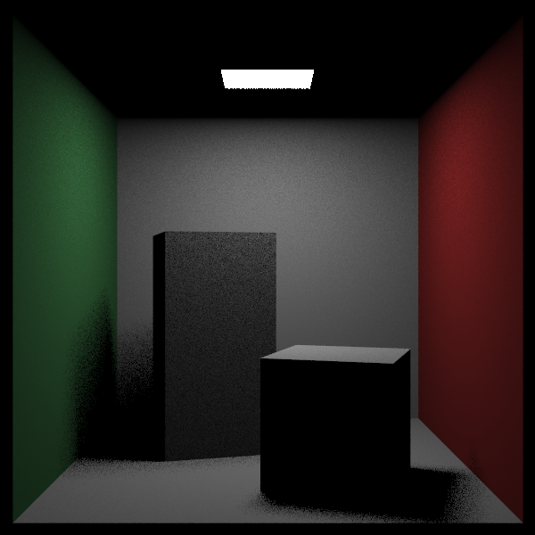
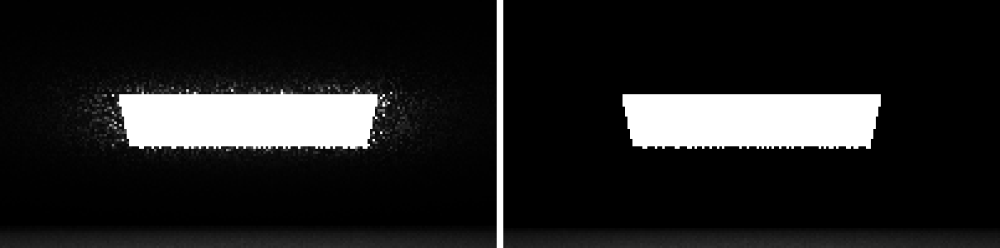

# Sampling Lights Directly (광원 직접 샘플링) — CUDA 적용판

> *Ray Tracing: The Rest of Your Life* 9장을 우리 **CUDA + 레이트레이싱 프로젝트** 기준으로 정리한 문서.
> 원서의 논지를 빠짐없이 따라가되 설명은 우리 말로 다시 썼고, 코드는 전부 우리 GPU 코드다. 실제로 빌드·렌더해서 노이즈와 시간을 측정했다.
> 원서: <https://raytracing.github.io/books/RayTracingTheRestOfYourLife.html> (v4.0.2) · 코드 커밋 `aaa242f`

---

> 💡 **이 장에서 CUDA 때문에 달라지는 큰 그림**
> 1. `RayColor`에 "광원 위의 점으로 레이 보내기"를 넣는다. 광원 좌표를 코드에 박아 둔 임시 구현이라, **3권 코넬 박스에서만** 켜고(`--nolightsample`로 끌 수 있다) 1·2권 장면은 건드리지 않는다.
> 2. 9 spp에서 뒷벽 노이즈가 **90.5 → 15.4**로 떨어지고, 렌더 시간도 **0.401초 → 0.025초**로 줄었다(경로가 한 바운스에 끝나기 때문).
> 3. 대신 이 단계의 그림은 **더 어둡다**(선형 평균 0.0683 → 0.0432). 광원 방향만 샘플링해서 나머지 적분을 통째로 버렸기 때문이다. 10장의 혼합 PDF에서 되살린다.
> 4. `Emitted`가 입사 레이와 히트 정보를 받아 **앞면에서만** 빛난다 → 광원과 천장 사이 틈의 반짝임이 사라진다(확대 비교 이미지).

---

## 왜 광원을 직접 샘플링하나

모든 방향에서 균일하게 샘플링하는 방식의 문제는 분명하다 — **광원이 다른 아무 방향보다 더 자주 뽑힐 이유가 없다는 것**이다. 장면에서 빛을 주는 것은 광원뿐인데, 레이는 광원을 우연히 맞힐 때까지 아무 데나 돌아다닌다.

직접 조명을 구하는 고전적인 방법으로 **섀도 레이(shadow ray)** 가 있다. 하지만 원서는 그 대신 **광원 쪽으로 레이를 더 많이 보내는 PDF**를 쓴다. 이 선택에는 큰 장점이 있다 — 나중에 PDF만 바꾸면 **광원이 아닌 어떤 방향으로든** 레이를 더 보낼 수 있다(12장에서 유리 구 쪽으로 보낸다).

광원 쪽 방향을 고르는 것 자체는 아주 쉽다. **광원 위에서 아무 점이나 하나 뽑아 그쪽으로 레이를 보내면 된다.** 문제는 그다음이다 — 렌더가 편향되지 않으려면 **그 방향의 PDF $p(\omega)$ 를 알아야 한다.** 그게 얼마인지 구하는 것이 이 절의 일이다.

---

## 광원의 PDF 구하기

넓이가 $A$ 인 광원 위에서 점을 **균일하게** 뽑는다면, **면적 기준** 밀도는 그냥 $p_q(q) = 1/A$ 다.

그런데 우리가 실제로 적분하는 공간은 면적이 아니라 **방향(입체각)** 이다. 그러면 이 광원의 표면 전체는 단위 구에 투영했을 때 얼마만큼의 넓이를 차지할까? 다행히 둘 사이에는 간단한 대응 관계가 있다.


광원 위의 작은 조각 $dA$ 를 뽑을 확률은 $p_q(q)\cdot dA$ 이고, 단위 구 위의 작은 조각 $d\omega$ 를 뽑을 확률은 $p(\omega)\cdot d\omega$ 다. 그리고 $d\omega$ 와 $dA$ 사이에는 기하학적 관계가 있다.

$$ d\omega = \frac{dA\cdot\cos\theta}{\operatorname{distance}^2(p,q)} $$

여기서 $\theta$ 는 광원 법선과 시선 사이의 각이다. $\cos\theta$ 는 비스듬히 볼수록 조각이 납작해 보이는 효과이고, 거리²로 나누는 것은 멀수록 작아 보이는 효과다.

**같은 조각을 뽑을 확률은 어느 공간에서 재든 같아야 하므로**

$$ p(\omega)\cdot d\omega = p_q(q)\cdot dA $$

여기에 위 두 사실을 대입한다.

$$ p(\omega)\cdot\frac{dA\cdot\cos\theta}{\operatorname{distance}^2(p,q)} = \frac{dA}{A} $$

$dA$ 가 양변에서 약분되고, 정리하면

$$ \boxed{p(\omega) = \frac{\operatorname{distance}^2(p,q)}{\cos\theta \cdot A}} $$

멀수록(거리² 커짐) 밀도가 커지고, 비스듬히 볼수록(cos 작아짐) 커진다 — 둘 다 "그 방향에서 보이는 광원이 작아진다"는 뜻이니 직관과 맞는다. 작게 보이는 것을 같은 횟수로 뽑았다면 그만큼 밀도가 높았다는 뜻이고, $f/p$ 에서 그만큼 깎여 나간다.

---

## 코드: 하드코딩 광원 샘플링

원서처럼 먼저 **개념이 맞는지 확인하는 하드코딩 버전**을 만든다. 재질이 정한 산란 방향을 버리고, 천장 광원 위의 무작위 점으로 레이를 보낸 뒤, 위에서 구한 밀도로 나눈다.

> 📄 **파일: `kernel.cu`** *(`RayColor`)* — 원서 Listing `ray-color-lights`에 대응

```cpp
if (bSampleLight && pdfValue > 0.0)
{
	// 광원 사각형 (x: 213~343, y: 554, z: 227~332) 위의 한 점
	double lightX = 213.0 + 130.0 * curand_uniform(randState);
	double lightZ = 227.0 + 105.0 * curand_uniform(randState);
	Point3 onLight(lightX, 554.0, lightZ);

	Vector3 toLight = onLight - rec.P;
	double distanceSquared = toLight.LengthSquared();
	toLight = UnitVector(toLight);

	// 표면 뒤쪽에 있는 광원으로는 보낼 수 없다.
	if (Dot(toLight, rec.Normal) < 0.0)
		return accumulated;

	double lightArea = (343.0 - 213.0) * (332.0 - 227.0);
	double lightCosine = fabs(toLight.Y());   // 광원 법선은 y축
	if (lightCosine < 0.000001)
		return accumulated;

	pdfValue = distanceSquared / (lightCosine * lightArea);
	scattered = Ray(rec.P, toLight, currentRay.Time());
}

double scatteringPdf = rec.MaterialPtr->ScatteringPdf(currentRay, rec, scattered);
```

> ⚠️ **순서 주의**: `scattered`를 광원 방향으로 **바꾼 뒤에** `ScatteringPdf`를 계산해야 한다. 먼저 계산해 두면 옛 방향의 pScatter를 쓰게 되어 조용히 틀린 그림이 나온다.

> 🔧 **1·2권 장면 보호**: 이 코드는 scene 10의 광원 좌표를 그대로 박아 둔 것이라, `bSampleLight` 플래그로 **3권 코넬 박스에서만** 켠다(`main`에서 `bSampleLight && bBook3Scene`). 커널 인자 하나가 늘었을 뿐이라 다른 장면의 경로는 그대로다. 비교용으로 `--nolightsample`을 주면 끌 수 있다.

---

## 결과: 같은 9 spp, 완전히 다른 그림

원서는 10 spp로 비교한다. 우리는 층화 격자 때문에 3×3 = 9 spp다.





| 9 spp 렌더 | 선형 평균 밝기 | 뒷벽 표준편차 | 시간 |
|---|---|---|---|
| 광원 직접 샘플링 | 0.0432 | **15.4** | **0.025초** |
| 광원 샘플링 없음 | 0.0683 | 90.5 | 0.401초 |
| (참고) 8장 961 spp | 0.0783 | 17.2 | 40.9초 |

- **노이즈**: 9 spp만으로 961 spp와 비슷한 매끈함을 얻었다. 모든 산란 레이가 광원을 맞히니 "빛을 못 찾아 검게 남는 샘플"이 사라진다.
- **속도**: 16배 빨라졌다. 광원을 맞히면 빛은 산란하지 않으므로 경로가 **한 바운스에서 끝난다**. GPU에서는 워프 안 모든 레인의 바운스 루프가 함께 짧아져 이득이 더 크다.
- **하지만 그림이 어둡다**: 이 버전은 광원 방향만 샘플링하므로 사실상 **직접광만** 계산한다. 벽 색이 물체에 번지는 색 번짐(color bleeding)이 사라지고 그림자도 딱딱하다. 적분의 나머지(다른 방향에서 오는 간접광)를 통째로 버린 셈이라, 이대로는 정답이 아니다. 10장에서 **표면 PDF와 광원 PDF를 섞어** 둘 다 살린다.

---

## 단방향 광원 (Switching to Unidirectional Light)

원서 이미지 7에는 천장 광원 주변에 반짝이는 점들이 보인다. 광원 사각형이 y = 554, 천장이 y = 555라 **그 사이의 좁은 틈**이 있는데, 광원이 양면으로 빛나면 그 틈을 들여다본 레이가 광원의 **뒷면**을 보고 아주 밝은 값을 가져오기 때문이다.

해결은 간단하다. `Emitted`가 입사 레이와 히트 정보를 받아, **앞면일 때만** 빛을 낸다.

> 📄 **파일: `Material.h`** — 원서 Listing `emitted-directional`에 대응

```cpp
// 재질 기본 클래스: 광원이 "어느 면으로 빛을 내는지" 판단할 수 있도록 rayIn과 rec를 넘긴다.
__device__ virtual Color Emitted(
    const Ray& rayIn, const HitRecord& rec, double u, double v, const Point3& p) const
{
    return Color(0.0, 0.0, 0.0);
}

// DiffuseLight: 앞면에서만 방출
__device__ Color Emitted(
    const Ray& rayIn, const HitRecord& rec, double u, double v, const Point3& p) const override
{
    if (!rec.bFrontFace)
        return Color(0.0, 0.0, 0.0);

    return mTexture->Value(u, v, p);
}
```

광원 주변(가로 200픽셀)을 3배 확대해 비교하면 차이가 분명하다. **왼쪽이 양면 발광(예전 동작), 오른쪽이 앞면만 발광(커밋된 코드)**이다.




광원 바로 위 띠(가로 140 × 세로 20픽셀)의 평균 밝기를 재면 **30.8 → 18.9**로, 틈에서 새어 나오던 밝은 점들이 사라졌다.

| 9 spp 렌더 | 광원 위 띠 평균 | 전체 선형 평균 |
|---|---|---|
| 양면 발광 (예전) | 30.8 | 0.0434 |
| 앞면만 발광 (커밋) | 18.9 | 0.0432 |

> 📝 양면 발광 이미지는 `DiffuseLight::Emitted`의 앞면 검사를 잠시 빼고 렌더한 것으로, **커밋에는 포함하지 않았다**.

---

## 결과 & 검증

- **빌드/실행 확인**: VS2022 + CUDA 12.9 Release로 컴파일·링크·실행 성공.
- **노이즈**: 9 spp 기준 뒷벽 표준편차 90.5 → 15.4.
- **속도**: 같은 9 spp에서 0.401초 → 0.025초.
- **틈 반짝임**: 광원 위 띠 평균 30.8 → 18.9.
- **1·2권 장면**: `bSampleLight`가 3권 장면에서만 켜지므로 영향 없음.

### 변경 파일 요약

| 원서 Listing | 우리 파일 | 메모 |
|---|---|---|
| `ray-color-lights` | `kernel.cu` (`RayColor`) | 광원 위의 점으로 레이를 보내고 거리²/(cos·넓이)로 나눈다 |
| `ray-color-lights-10spp` | `kernel.cu` (`main`) | `bSampleLight` 게이트, `--nolightsample` 옵션 |
| `emitted-directional` | `Material.h` | `Emitted(rayIn, rec, u, v, p)`, 앞면에서만 발광 |
| `emitted-ray-color` | `kernel.cu` (`RayColor`) | 새 `Emitted` 호출 |

### CUDA 적용에서 꼭 기억할 3가지

1. **광원 샘플링은 노이즈뿐 아니라 "경로 길이"도 줄인다**: 빛에 닿으면 경로가 끝나므로 워프의 바운스 루프가 함께 짧아져 GPU에서 특히 크게 이득이다(16배).
2. **실험적 하드코딩은 장면 플래그로 가둔다**: 커널 인자 하나(`bSampleLight`)로 켜고 끄면, 임시 구현이 다른 장면을 망가뜨리지 않는다.
3. **`scattered`를 바꾸면 pScatter도 다시 계산**: 방향을 바꾼 뒤에 `ScatteringPdf`를 불러야 한다. 순서를 틀려도 그럴듯한 그림이 나와서 알아채기 어렵다.
